# Agent 设计文档

## 项目概述

本项目旨在构建一个基于PEG（Price/Earnings to Growth）指标的科技股估值分析系统，包含数据采集、回测验证和实时筛选功能。

## 🎯 核心设计原则

### 1. SSOT (Single Source of Truth)
**原则**：本质相同的东西放到一个文件夹或一个文件

**实践**：
- ✅ 所有文档集中在 `docs/` 目录
- ✅ 所有数据集中在 `data/` 目录
- ✅ Schema定义统一在 `core/schemas/`
- ✅ 配置统一在 `config.yaml`（单一配置源）
- ✅ 删除重复的 `requirements.txt`（使用 `pyproject.toml`）

### 2. 数据持久化
**原则**：数据处理的中间过程尽可能持久化，便于调试

**实践**：
- ✅ `data/raw/` - 保存API原始响应（7天）
- ✅ `data/processed/` - 保存处理后数据（30天）
- ✅ `data/cache/` - 24小时缓存
- ✅ `data/results/` - 最终结果（永久）
- ✅ `data/logs/` - 完整处理日志（90天）
- ✅ Pipeline追踪：每个数据都有完整的处理历史

### 3. 数据质量优先
**原则**：宁可为空，不要使用错的数据

**实践**：
- ✅ 双数据源交叉验证（一致性≥75%）
- ✅ 严格的ValidationRules（10+验证规则）
- ✅ 三级置信度评估（HIGH/MEDIUM/LOW）
- ✅ 自动拒绝异常数据

---

## 系统架构

```mermaid
graph TB
    A[数据采集模块] --> B[数据处理层]
    B --> C[策略计算模块]
    B --> D[回测引擎]
    C --> E[结果输出]
    D --> E
    
    A1[yfinance API] --> A
    A2[Alpha Vantage API] --> A
    A3[Yahoo Finance] --> A
    
    E --> F1[Markdown报告]
    E --> F2[CSV数据表]
    E --> F3[可视化图表]
    
    style A fill:#B0E0E6
    style B fill:#FFE4B5
    style C fill:#98FB98
    style D fill:#DDA0DD
    style E fill:#F0E68C
```



---

## 模块设计

### 1. 数据采集模块 (data_collection/)

#### 职责
- 获取股票基础数据（价格、财务指标）
- 计算PEG相关指标
- 数据验证与清洗
- 多数据源容错机制

#### 核心功能
1. **fetch_current_peg.py**
   - 获取指定股票列表的实时PEG数据
   - 输入：股票代码列表
   - 输出：包含利润、增速、PE、PEG的CSV文件

2. **screen_low_peg.py**
   - 从VGT+KWEB成分股筛选低PEG标的
   - 筛选条件：净利润>$10M, 按PEG排序
   - 输出：Top 15低PEG股票列表

3. **fetch_etf_holdings.py**
   - 获取ETF成分股列表（VGT, KWEB, SPY）
   - 处理权重信息
   - 定期更新机制

#### 数据源策略
- **主数据源**：yfinance（免费，数据全面）
- **备用数据源**：Alpha Vantage / Yahoo Finance API
- **容错逻辑**：
  ```python
  def fetch_with_fallback(ticker):
      try:
          data = yfinance.fetch(ticker)
          if validate(data):
              return data
      except:
          pass
      
      try:
          data = alpha_vantage.fetch(ticker)
          return data
      except:
          raise DataFetchError(ticker)
  ```

#### 数据验证
- PE合理性：0 < PE < 300
- 增长率合理性：-100% < g < 500%
- 跨源数据一致性：偏差<5%

---

### 2. 回测引擎 (backtest/)

#### 职责
- 历史数据回测（2000-2025）
- 策略参数优化
- 绩效评估与可视化

#### 核心功能
1. **run_single_backtest.py**
   - 单只股票回测
   - 参数：买入阈值、卖出阈值
   - 输出：年化收益、最大回撤、夏普比率

2. **run_batch_backtest.py**
   - 批量回测（多股票/多参数）
   - 并行处理加速
   - 生成对比报告

3. **optimize_params.py**
   - 网格搜索最优参数
   - 回测窗口：滚动窗口验证
   - 防止过拟合

#### 回测逻辑
```python
class PEGBacktester:
    def __init__(self, ticker, buy_threshold=0.8, sell_threshold=1.5):
        self.ticker = ticker
        self.buy_threshold = buy_threshold
        self.sell_threshold = sell_threshold
        self.portfolio = Portfolio(initial_cash=100000)
    
    def run(self, start_date, end_date):
        for month in monthly_range(start_date, end_date):
            peg = self.calculate_peg(month)
            
            # 交易信号
            if peg < self.buy_threshold and not self.portfolio.has_position:
                self.portfolio.buy(self.ticker, month)
            elif peg > self.sell_threshold and self.portfolio.has_position:
                self.portfolio.sell(self.ticker, month)
            
            # 记录绩效
            self.record_metrics(month)
        
        return self.generate_report()
    
    def calculate_peg(self, date):
        price = self.get_price(date)
        eps = self.get_eps(date)
        growth = self.get_growth_rate(date)
        
        pe = price / eps
        peg = pe / (growth * 100)
        return peg
```

#### 绩效指标
- **年化收益率**：\( r_{annual} = (V_{end}/V_{start})^{1/years} - 1 \)
- **最大回撤**：\( MDD = \max(1 - V_t/V_{peak}) \)
- **夏普比率**：\( Sharpe = \frac{r_p - r_f}{\sigma_p} \)
- **胜率**：盈利交易次数 / 总交易次数

---

### 3. 策略计算模块 (core/)

#### 职责
- PEG计算引擎
- 财务指标提取
- 数据缓存管理

#### 核心算法
```python
def calculate_peg(ticker: str, date: str = 'latest') -> PEGData:
    """
    计算PEG指标
    
    Args:
        ticker: 股票代码（如'MSFT', '00700.HK'）
        date: 计算日期（默认最新）
    
    Returns:
        PEGData(profit, growth_rate, pe, peg)
    """
    # 1. 获取财务数据
    income_stmt = fetch_income_statement(ticker, date)
    price = fetch_stock_price(ticker, date)
    
    # 2. 计算TTM净利润
    ttm_profit = sum(income_stmt['net_income'][-4:])  # 最近4季度
    
    # 3. 计算利润增速
    ttm_profit_last_year = sum(income_stmt['net_income'][-8:-4])
    growth_rate = (ttm_profit - ttm_profit_last_year) / ttm_profit_last_year
    
    # 4. 计算PE
    shares_outstanding = fetch_shares_outstanding(ticker, date)
    eps = ttm_profit / shares_outstanding
    pe = price / eps
    
    # 5. 计算PEG
    peg = pe / (growth_rate * 100)
    
    return PEGData(
        profit=ttm_profit,
        growth_rate=growth_rate,
        pe=pe,
        peg=peg
    )
```

---

## 数据流设计

```mermaid
sequenceDiagram
    participant User
    participant DataCollector
    participant DataValidator
    participant Calculator
    participant Storage
    
    User->>DataCollector: 请求股票数据
    DataCollector->>DataCollector: 尝试yfinance
    alt yfinance成功
        DataCollector->>DataValidator: 返回原始数据
    else yfinance失败
        DataCollector->>DataCollector: 尝试Alpha Vantage
        DataCollector->>DataValidator: 返回原始数据
    end
    
    DataValidator->>DataValidator: 验证数据质量
    DataValidator->>Calculator: 传递清洗后数据
    Calculator->>Calculator: 计算PEG指标
    Calculator->>Storage: 存储结果
    Storage->>User: 返回计算结果
```



---

## 配置管理

### config.yaml
```yaml
# 数据源配置
data_sources:
  primary: yfinance
  fallback:
    - alpha_vantage
    - yahoo_finance
  
  api_keys:
    alpha_vantage: ${ALPHA_VANTAGE_API_KEY}

# 策略参数
strategy:
  peg_buy_threshold: 0.8
  peg_sell_threshold: 1.5
  min_profit_usd: 10_000_000  # $10M
  top_n_stocks: 15

# 回测参数
backtest:
  start_date: "2000-01-01"
  end_date: "2025-11-14"
  initial_cash: 100000
  transaction_cost: 0.001  # 0.1%
  rebalance_freq: "monthly"

# ETF成分股
etf_tickers:
  vgt: 
    name: "Vanguard Information Technology ETF"
    approximate_holdings: 330
  kweb:
    name: "KraneShares CSI China Internet ETF"
    approximate_holdings: 50
  spy:
    name: "SPDR S&P 500 ETF Trust"
    approximate_holdings: 500

# 目标股票列表
target_stocks:
  mag7_us:
    - AAPL
    - MSFT
    - GOOGL
    - AMZN
    - NVDA
    - META
    - TSLA
  
  hk_tech:
    - 00700.HK  # 腾讯
    - 09988.HK  # 阿里巴巴
    - 03690.HK  # 美团
    - 01810.HK  # 小米
    - 09618.HK  # 京东
    - 01211.HK  # 比亚迪
    - 09999.HK  # 网易

# 输出配置
output:
  format: 
    - markdown
    - csv
  path: "./results"
  timestamp: true
```

---

## 错误处理

### 异常分类
1. **数据获取失败**：`DataFetchError`
   - 重试机制（最多3次）
   - 切换备用数据源
   - 记录失败日志

2. **数据验证失败**：`DataValidationError`
   - 标记异常数据
   - 提示人工复核
   - 跳过该标的

3. **计算异常**：`CalculationError`
   - 增长率为负：PEG设为NaN
   - 除零错误：返回警告
   - 数据缺失：使用占位符

### 日志系统
```python
import logging

logging.basicConfig(
    level=logging.INFO,
    format='%(asctime)s - %(name)s - %(levelname)s - %(message)s',
    handlers=[
        logging.FileHandler('peg_scanner.log'),
        logging.StreamHandler()
    ]
)

logger = logging.getLogger(__name__)
```

---

## 性能优化

### 缓存策略
- **本地缓存**：缓存每日数据，避免重复API调用
- **缓存有效期**：24小时
- **缓存结构**：
  ```
  cache/
    ├── prices/
    │   ├── MSFT_2025-11-14.json
    │   └── ...
    ├── financials/
    │   ├── MSFT_Q3_2024.json
    │   └── ...
    └── peg_results/
        └── vgt_kweb_top15_2025-11-14.csv
  ```

### 并行处理
```python
from concurrent.futures import ThreadPoolExecutor

def fetch_peg_parallel(tickers):
    with ThreadPoolExecutor(max_workers=10) as executor:
        results = executor.map(calculate_peg, tickers)
    return list(results)
```

---

## 测试策略

### 单元测试
- 测试PEG计算准确性
- 测试数据验证逻辑
- 测试异常处理

### 集成测试
- 端到端数据流测试
- 回测结果一致性验证

### 测试用例
```python
def test_peg_calculation():
    # 已知数据
    ticker = "MSFT"
    expected_peg = 1.61
    
    # 计算
    result = calculate_peg(ticker, date="2025-11-14")
    
    # 断言
    assert abs(result.peg - expected_peg) < 0.05
```

---

## 开发路线图

### Phase 1: MVP（当前阶段）✅
- [x] 项目结构搭建
- [ ] 基础数据采集功能
- [ ] 简单PEG计算
- [ ] 单股票回测

### Phase 2: 功能完善
- [ ] 多数据源集成
- [ ] 批量回测
- [ ] 参数优化
- [ ] ETF成分股获取

### Phase 3: 增强功能
- [ ] 实时监控告警
- [ ] Web可视化界面
- [ ] 自动化报告生成
- [ ] 机器学习增强预测

### Phase 4: 生产化
- [ ] Docker容器化
- [ ] CI/CD流水线
- [ ] 云端部署
- [ ] 性能监控

---

## 依赖管理

### 核心依赖
```toml
[project]
name = "peg-scanner"
version = "1.0.0"
dependencies = [
    "yfinance>=0.2.38",
    "pandas>=2.2.0",
    "numpy>=1.26.0",
    "requests>=2.31.0",
    "pyyaml>=6.0.1",
    "python-dotenv>=1.0.0",
]

[project.optional-dependencies]
dev = [
    "pytest>=8.0.0",
    "black>=24.0.0",
    "ruff>=0.3.0",
]

visualization = [
    "matplotlib>=3.8.0",
    "plotly>=5.18.0",
]
```

---

## 贡献指南

### 代码规范
- 使用 `black` 格式化代码
- 使用 `ruff` 进行lint检查
- 函数需包含类型注解和文档字符串
- 单元测试覆盖率 > 80%

### Git工作流
```bash
# 创建功能分支
git checkout -b feature/new-data-source

# 提交代码
git add .
git commit -m "feat: add alpha vantage data source"

# 推送并创建PR
git push origin feature/new-data-source
```

---

## 常见问题

### Q1: 为什么选择PEG而不是PE？
**A**: PEG考虑了增长率，更适合评估成长型科技股。纯PE容易误判高增长公司。

### Q2: 数据源不稳定怎么办？
**A**: 项目内置多数据源容错机制，自动切换备用API。

### Q3: 如何添加新的数据源？
**A**: 实现 `DataSourceInterface` 接口，在 `config.yaml` 中注册即可。

### Q4: 回测结果与实际差异大？
**A**: 需考虑：
- 交易成本
- 滑点
- 数据存活偏差
- 市场流动性

---

**文档版本**：v1.0.0  
**最后更新**：2025-11-15  
**维护者**：Project Team

