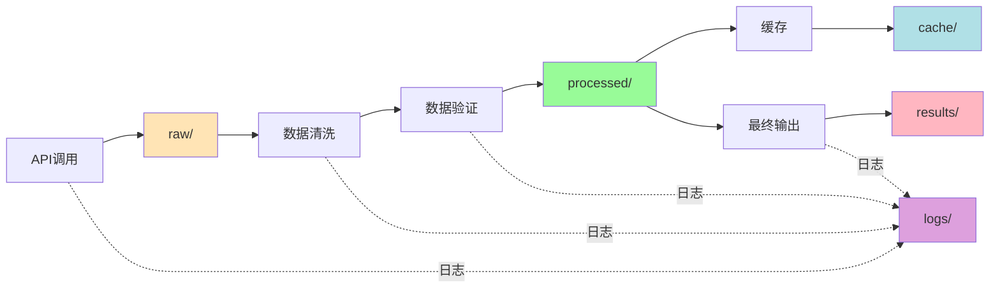

# Data 目录说明

**上级文档**：[返回项目README](../README.md)

---

## 📂 目录结构（数据持久化原则）

遵循"数据处理的中间过程尽可能持久化"原则，所有数据按处理阶段组织：

```
data/
├── raw/           # 原始数据（API响应）
├── processed/     # 处理后数据（清洗、验证后）
├── cache/         # 缓存数据（24小时有效）
├── results/       # 最终结果（CSV、Markdown）
└── logs/          # 数据处理日志
```

---

## 📁 各目录说明

### 1. `raw/` - 原始数据

**用途**：保存API原始响应，便于调试和数据审计

**格式**：JSON文件

**命名规则**：`{ticker}_{source}_{date}.json`

**示例**：
```json
// MSFT_yfinance_2025-11-15.json
{
  "ticker": "MSFT",
  "source": "yfinance",
  "timestamp": "2025-11-15T10:30:00",
  "raw_data": { ... }
}
```

**保留期**：7天

---

### 2. `processed/` - 处理后数据

**用途**：保存清洗、验证后的标准化数据

**格式**：JSON文件（符合StockDataSchema）

**命名规则**：`{ticker}_processed_{date}.json`

**示例**：
```json
// MSFT_processed_2025-11-15.json
{
  "ticker": "MSFT",
  "date": "2025-11-15",
  "price": 510.18,
  "pe": 36.14,
  "peg": 2.33,
  "data_source": "yfinance+alpha_vantage",
  "confidence": "HIGH",
  "processing_steps": [
    "1. 获取yfinance数据",
    "2. 获取Alpha Vantage数据",
    "3. 交叉验证（一致性98%）",
    "4. 数据融合"
  ]
}
```

**保留期**：30天

---

### 3. `cache/` - 缓存数据

**用途**：24小时缓存，加速重复查询

**格式**：JSON文件

**命名规则**：`{ticker}_{date}.json`

**管理**：由 `CacheManager` 自动管理

**特点**：
- 自动过期（24小时）
- 自动清理（每周）
- 支持手动清除

**示例**：
```bash
# 查看缓存
ls data/cache/

# 清除缓存
rm data/cache/*.json
```

---

### 4. `results/` - 最终结果

**用途**：保存最终分析结果

**格式**：CSV + Markdown

**文件类型**：

#### 4.1 PEG数据表
- `mag7_peg_{date}.csv`
- `mag7_peg_{date}.md`

#### 4.2 筛选结果
- `low_peg_top15_{date}.csv`
- `low_peg_top15_{date}.md`

#### 4.3 回测结果（Phase 2）
- `backtest_{ticker}_{date}.csv`
- `backtest_summary_{date}.md`

**保留期**：永久

---

### 5. `logs/` - 数据处理日志

**用途**：记录每次数据处理的详细过程

**格式**：按日期组织的日志文件

**命名规则**：`data_processing_{date}.log`

**日志级别**：
- `DEBUG`：详细的处理步骤
- `INFO`：关键节点
- `WARNING`：数据质量警告
- `ERROR`：处理失败

**示例日志**：
```
2025-11-15 10:30:00 | INFO | 开始获取MSFT数据
2025-11-15 10:30:01 | DEBUG | yfinance API调用成功
2025-11-15 10:30:02 | DEBUG | Alpha Vantage API调用成功
2025-11-15 10:30:03 | INFO | 交叉验证：一致性98%
2025-11-15 10:30:03 | INFO | 数据保存到processed/
2025-11-15 10:30:03 | INFO | MSFT数据获取完成（耗时3.2s）
```

---

## 🔄 数据流图



---

## 📊 数据追溯

### Pipeline追踪

每个数据文件都包含完整的处理历史：

```json
{
  "ticker": "MSFT",
  "data": { ... },
  "metadata": {
    "pipeline_id": "20251115_103000_MSFT",
    "processing_steps": [
      {
        "step": 1,
        "action": "fetch_yfinance",
        "timestamp": "2025-11-15T10:30:01",
        "status": "success",
        "duration_ms": 1234
      },
      {
        "step": 2,
        "action": "cross_validation",
        "timestamp": "2025-11-15T10:30:03",
        "status": "success",
        "consistency": 0.98
      }
    ],
    "data_sources": ["yfinance", "alpha_vantage"],
    "confidence": "HIGH"
  }
}
```

### 错误追踪

失败的数据处理会完整记录：

```json
{
  "ticker": "00700.HK",
  "status": "failed",
  "error": "无法获取价格数据",
  "processing_steps": [
    {
      "step": 1,
      "action": "fetch_yfinance",
      "status": "failed",
      "error": "HTTP 404: Quote not found"
    }
  ],
  "timestamp": "2025-11-15T10:30:05"
}
```

---

## 🧹 数据管理

### 清理策略

```bash
# 清理过期缓存（>24小时）
python -c "
from data_collection.cache_manager import CacheManager
cache = CacheManager(cache_dir='data/cache')
count = cache.clear_expired()
print(f'清理了 {count} 个过期缓存')
"

# 清理旧的raw数据（>7天）
find data/raw -name "*.json" -mtime +7 -delete

# 清理旧的processed数据（>30天）
find data/processed -name "*.json" -mtime +30 -delete
```

### 备份策略

```bash
# 备份results目录（重要结果）
tar -czf results_backup_$(date +%Y%m%d).tar.gz data/results/

# 备份到云端（可选）
# aws s3 sync data/results/ s3://your-bucket/peg-scanner/results/
```

---

## 📈 数据统计

查看数据使用情况：

```bash
# 统计各目录大小
du -sh data/*

# 统计文件数量
find data -type f | wc -l

# 统计最近的处理
ls -lth data/results/ | head -10
```

---

## 🔍 调试指南

### 问题：数据不一致

1. 检查raw数据：`cat data/raw/{ticker}_*.json`
2. 检查处理日志：`grep {ticker} data/logs/*.log`
3. 查看validation结果：`cat data/processed/{ticker}_*.json`

### 问题：缓存命中率低

1. 检查缓存目录：`ls -lh data/cache/`
2. 查看缓存统计：运行 `CacheManager.get_cache_size()`

### 问题：结果异常

1. 追溯pipeline：查看 `metadata.processing_steps`
2. 检查置信度：查看 `confidence` 字段
3. 对比raw数据：验证原始值

---

## ⚙️ 配置

数据目录配置在 `config.yaml`：

```yaml
data:
  base_dir: "./data"
  
  raw:
    enabled: true
    retention_days: 7
  
  processed:
    enabled: true
    retention_days: 30
  
  cache:
    enabled: true
    expiry_hours: 24
    max_size_mb: 1024
  
  results:
    formats: ["csv", "markdown"]
    timestamp: true
  
  logs:
    level: "INFO"
    rotation: "daily"
    retention_days: 90
```

---

**数据管理原则**：
1. ✅ 中间过程全部持久化
2. ✅ 完整的处理历史追踪
3. ✅ 便于调试和审计
4. ✅ 自动化的清理策略

