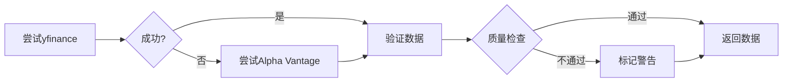

# 数据采集模块

**上级文档**：[返回项目README](../README.md)

---

## 简介

本模块负责从多个免费数据源获取股票实时数据，计算PEG相关指标，并提供数据筛选功能。

## 核心功能

- ✅ 多数据源支持（yfinance, Alpha Vantage）
- ✅ 数据验证与容错
- ✅ PEG指标计算
- ✅ ETF成分股获取
- ✅ 低PEG股票筛选
- ✅ 数据缓存管理

## 使用方法

### 获取七姐妹PEG数据

```bash
# 获取美股+港股七姐妹当前PEG
uv run python -m data_collection.fetch_current_peg

# 输出: results/mag7_peg_2025-11-14.csv
```

### 筛选低PEG股票

```bash
# 从VGT+KWEB筛选PEG最低的15只股票
uv run python -m data_collection.screen_low_peg

# 自定义筛选条件
uv run python -m data_collection.screen_low_peg \
    --min-profit 50000000 \
    --top-n 20
```

### 获取ETF成分股

```bash
# 获取VGT成分股列表
uv run python -m data_collection.fetch_etf_holdings --etf VGT

# 获取KWEB成分股列表
uv run python -m data_collection.fetch_etf_holdings --etf KWEB
```

## 目录结构

```
data_collection/
├── __init__.py
├── README.md
├── TODO.md                    # 开发任务列表
├── cache/                     # 数据缓存目录
├── fetch_yfinance.py         # yfinance数据源
├── fetch_alpha_vantage.py    # Alpha Vantage数据源
├── data_validator.py         # 数据验证
├── fetch_current_peg.py      # 获取当前PEG
├── screen_low_peg.py         # 筛选低PEG股票
├── fetch_etf_holdings.py     # ETF成分股获取
├── cache_manager.py          # 缓存管理
└── format_utils.py           # 格式化工具
```

## 数据源说明

### 主数据源：yfinance
- **优点**: 免费、无API限制、数据全面
- **覆盖**: 美股、港股、全球主要市场
- **更新频率**: 日级别
- **限制**: 无官方支持，偶尔不稳定

### 备用数据源：Alpha Vantage
- **优点**: 官方API、稳定性好
- **覆盖**: 美股为主
- **更新频率**: 日级别
- **限制**: 免费版每分钟5次、每天500次

### 数据验证机制



## 输出格式

### PEG表格（CSV）

```csv
ticker,company_name,profit,growth_rate,pe,peg,date,confidence
MSFT,微软<MSFT.US>,88100000000,0.218,35.2,1.61,2025-11-14,HIGH
AMZN,亚马逊<AMZN.US>,48300000000,2.26,42.8,0.19,2025-11-14,HIGH
00700.HK,腾讯<00700.HK>,179400000000,0.362,21.5,0.59,2025-11-14,HIGH
```

### PEG表格（Markdown）

```markdown
| 公司名称 | 净利润 | 利润增速 | TTM PE | PEG |
|---------|--------|---------|--------|-----|
| 微软<MSFT.US> | $88.1B | 21.8% | 35.2 | **1.61** |
| 亚马逊<AMZN.US> | $48.3B | 226% | 42.8 | **0.19** |
| 腾讯<00700.HK> | ¥179.4B | 36.2% | 21.5 | **0.59** |
```

## 配置说明

在项目根目录创建 `.env` 文件（参考 `.env.example`）：

```bash
# Alpha Vantage API Key（可选）
ALPHA_VANTAGE_API_KEY=your_api_key_here

# 数据源选择
PRIMARY_DATA_SOURCE=yfinance
FALLBACK_DATA_SOURCE=alpha_vantage

# 缓存配置
CACHE_ENABLED=true
CACHE_EXPIRY_HOURS=24
```

## 开发进度

详见 [TODO.md](TODO.md)

## 常见问题

### Q: 为什么港股数据获取失败？
A: 确保使用正确的后缀格式，如 `00700.HK`（腾讯）。某些API可能对港股支持有限，系统会自动尝试备用数据源。

### Q: 如何加速批量数据获取？
A: 
1. 启用缓存（`CACHE_ENABLED=true`）
2. 使用并行处理（默认10个worker）
3. 避免频繁重复请求

### Q: 数据偏差过大怎么办？
A: 系统会自动标记偏差>5%的数据为低置信度，建议人工复核。

---

**最后更新**: 2025-11-15

