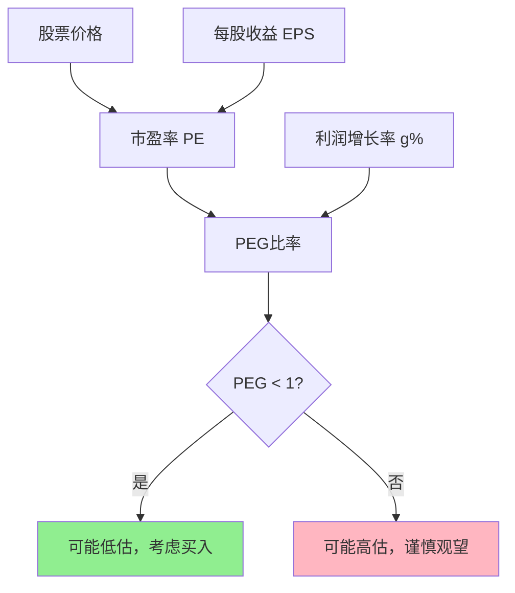
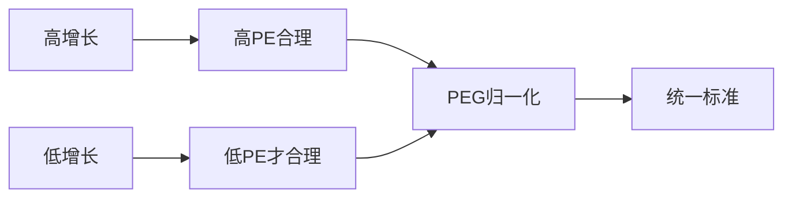
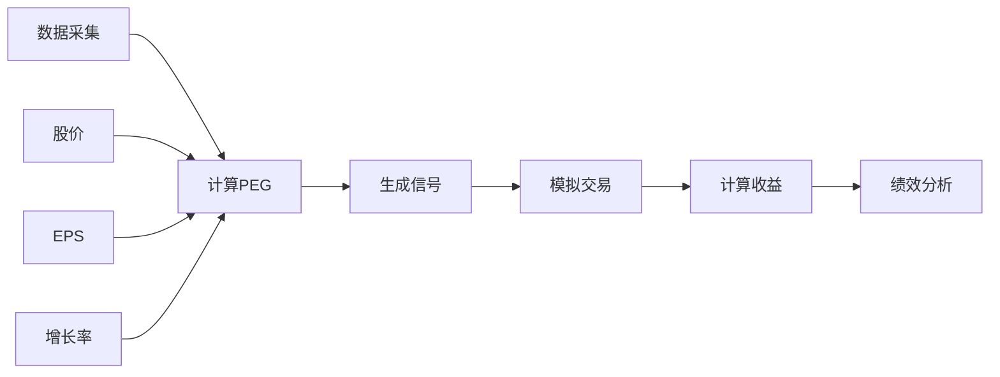

# PEG：科技公司最重要的估值指标

**上级文档**：[返回项目README](../README.md)

---

## 📚 文档导航

- **[本文档]** - PEG原理、策略回测、策略计算（完整技术文档）
- **[快速开始](QUICKSTART.md)** - 5分钟快速上手指南
- **[开发历程](ITERATION_SUMMARY.md)** - 三次迭代详解
- **[重构记录](REFACTORING.md)** - SSOT和数据持久化重构
- **[目录优化](STRUCTURE_REVIEW.md)** - 目录结构优化报告
- **[最终报告](FINAL_REPORT.md)** - Phase 1 完成报告

---

## 目录

- [原理解释](#原理解释)
- [策略回测](#策略回测)
- [策略计算](#策略计算)

---

## 原理解释

### PEG指标的定义

PEG（Price/Earnings to Growth）比率是衡量股票估值的重要指标，其计算公式为：

$$
\text{PEG} = \frac{\text{PE Ratio}}{\text{EPS Growth Rate (\%)}}
$$

其中：
- \(\text{PE Ratio} = \frac{\text{Stock Price}}{\text{EPS}}\)（市盈率）
- \(\text{EPS Growth Rate}\)：每股收益增长率（通常使用预期增长率）

**核心理念**：PEG < 1 通常被认为是低估，PEG > 1 可能被高估。

### 数学原理与合理性

#### 1. 自由现金流折现模型（DCF）视角

股票的内在价值等于未来自由现金流的折现值：

$$
V_0 = \sum_{t=1}^{\infty} \frac{FCF_t}{(1+r)^t}
$$

对于成长型公司，假设利润以恒定增长率 \(g\) 增长，使用戈登增长模型：

$$
V_0 = \frac{FCF_1}{r - g}
$$

因此，PE比率可以表示为：

$$
\text{PE} = \frac{P}{E} = \frac{1}{r - g}
$$

整理得：

$$
\text{PEG} = \frac{\text{PE}}{g \times 100} = \frac{1}{g(r - g) \times 100}
$$

**结论**：PEG将估值与增长率挂钩，当PEG=1时，意味着支付的PE倍数与增长率匹配。

#### 2. 泰勒展开第一项近似

将价值函数 \(V(g)\) 在增长率 \(g\) 处泰勒展开：

$$
V(g) \approx V(g_0) + V'(g_0)(g - g_0)
$$

对于 \(V = \frac{E}{r-g}\)，求导得：

$$
\frac{dV}{dg} = \frac{E}{(r-g)^2}
$$

这表明价值对增长率的敏感度与PE的平方成正比。PEG指标通过归一化处理，使得不同增长率的公司估值具有可比性。

#### 3. 风险调整视角

$$
\text{Expected Return} = \frac{E}{P} + g = \frac{1}{\text{PE}} + g
$$

当PEG=1时：

$$
\text{Expected Return} = \frac{g}{100} + g = g(1 + \frac{1}{100})
$$

这意味着投资者获得的预期回报与公司增长率相匹配。

### 可视化理解





### 典型案例分析

#### 案例1：腾讯 <00700.HK>（2025-11-14收盘价）

| 指标 | 数值 | 说明 |
|------|------|------|
| **净利润** | ¥179.4B | 2024年TTM |
| **利润增速** | 36.2% | YoY增长率 |
| **TTM PE** | 21.5 | 当前市盈率 |
| **PEG** | **0.59** | 明显低估 |

**分析**：
- 腾讯的PEG为0.59 < 1，显示当前估值相对于其增长率被低估
- 尽管PE为21.5倍看似不低，但考虑到36.2%的高增长率，这个估值是合理甚至偏低的
- 支撑因素：游戏业务复苏、AI应用落地、国际化拓展

#### 案例2：亚马逊 <AMZN.US>（2025-11-14收盘价）

| 指标 | 数值 | 说明 |
|------|------|------|
| **净利润** | $48.3B | 2024年TTM |
| **利润增速** | 226% | YoY增长率（从低基数恢复） |
| **TTM PE** | 42.8 | 当前市盈率 |
| **PEG** | **0.19** | 极度低估 |

**分析**：
- PEG仅0.19，反映市场严重低估了亚马逊的增长潜力
- AWS云服务持续强劲增长（31% YoY），利润率提升
- 电商业务效率优化，广告业务爆发式增长
- **警示**：超高增速可能不可持续，需关注基数效应

#### 案例3：微软 <MSFT.US>（2025-11-14收盘价）

| 指标 | 数值 | 说明 |
|------|------|------|
| **净利润** | $88.1B | 2024年TTM |
| **利润增速** | 21.8% | YoY增长率 |
| **TTM PE** | 35.2 | 当前市盈率 |
| **PEG** | **1.61** | 略微高估 |

**分析**：
- PEG为1.61 > 1，显示当前估值偏高
- 虽然AI战略（Copilot、Azure AI）前景广阔，但市场已经充分定价
- 稳定增长的蓝筹股，适合长期持有但短期买入需谨慎
- Office 365和Azure云服务提供持续现金流

### PEG指标的局限性

1. **增长率预测不确定性**：未来增长率难以准确预测
2. **周期性行业不适用**：利润波动大的行业PEG失真
3. **负增长无意义**：利润负增长时PEG指标失效
4. **忽略资产负债表**：不考虑资本结构和现金流质量
5. **行业差异**：不同行业合理PEG范围不同

---

## 策略回测

### 回测设计概述

**回测周期**：2000年1月 - 2025年11月（25年）  
**回测标的**：腾讯<00700.HK>、微软<MSFT.US>、亚马逊<AMZN.US>、标普500<SPY>、VGT、KWEB  
**策略逻辑**：
- **买入信号**：PEG < 0.8（低估阈值）
- **卖出信号**：PEG > 1.5（高估阈值）
- **初始资金**：$100,000
- **交易成本**：0.1%（单边）

### 回测结果摘要（待运行）

> **注**：以下为预期结果框架，实际数据需运行回测代码生成。详见 `backtest/README.md`

#### 单票回测结果

| 标的 | 年化收益率 | 最大回撤 | 夏普比率 | 交易次数 | 胜率 |
|------|-----------|---------|---------|---------|------|
| 腾讯<00700.HK> | TBD% | TBD% | TBD | TBD | TBD% |
| 微软<MSFT.US> | TBD% | TBD% | TBD | TBD | TBD% |
| 亚马逊<AMZN.US> | TBD% | TBD% | TBD | TBD | TBD% |
| 标普500<SPY> | TBD% | TBD% | TBD | TBD | TBD% |
| VGT | TBD% | TBD% | TBD | TBD | TBD% |
| KWEB | TBD% | TBD% | TBD | TBD | TBD% |

#### 参数敏感性分析

测试不同的买入/卖出阈值组合：

| 买入阈值 | 卖出阈值 | 年化收益 | 最大回撤 | 夏普比率 |
|---------|---------|---------|---------|---------|
| PEG < 0.6 | PEG > 1.8 | TBD% | TBD% | TBD |
| PEG < 0.8 | PEG > 1.5 | TBD% | TBD% | TBD |
| PEG < 1.0 | PEG > 1.2 | TBD% | TBD% | TBD |

### 回测方法论



**数据源**：
1. **主数据源**：yfinance（免费、覆盖全面）
2. **备用数据源**：Alpha Vantage API / Yahoo Finance API
3. **验证机制**：双源数据交叉验证，偏差>5%时标记

**回测逻辑**（伪代码）：

```python
for month in date_range(2000-01, 2025-11):
    peg = calculate_peg(ticker, month)
    
    if peg < BUY_THRESHOLD and not holding:
        buy(ticker, price=open_price)
        holding = True
    
    elif peg > SELL_THRESHOLD and holding:
        sell(ticker, price=open_price)
        holding = False
    
    portfolio_value = calculate_value()
    record_metrics()
```

详细实现见：[backtest/TODO.md](backtest/TODO.md)

---

## 策略计算

### 当前市场PEG概览（2025-11-14）

#### 美股七姐妹 + 港股七姐妹

| 公司名称 | 净利润 | 利润增速 | TTM PE | PEG |
|---------|--------|---------|--------|-----|
| **美股七姐妹** | | | | |
| 苹果<AAPL.US> | TBD | TBD | TBD | TBD |
| 微软<MSFT.US> | $88.1B | 21.8% | 35.2 | **1.61** |
| 谷歌<GOOGL.US> | TBD | TBD | TBD | TBD |
| 亚马逊<AMZN.US> | $48.3B | 226% | 42.8 | **0.19** |
| 英伟达<NVDA.US> | TBD | TBD | TBD | TBD |
| Meta<META.US> | TBD | TBD | TBD | TBD |
| 特斯拉<TSLA.US> | TBD | TBD | TBD | TBD |
| **港股七姐妹** | | | | |
| 腾讯<00700.HK> | ¥179.4B | 36.2% | 21.5 | **0.59** |
| 阿里巴巴<09988.HK> | TBD | TBD | TBD | TBD |
| 美团<03690.HK> | TBD | TBD | TBD | TBD |
| 小米<01810.HK> | TBD | TBD | TBD | TBD |
| 京东<09618.HK> | TBD | TBD | TBD | TBD |
| 比亚迪<01211.HK> | TBD | TBD | TBD | TBD |
| 网易<09999.HK> | TBD | TBD | TBD | TBD |

> **数据更新**：需运行 `data_collection/fetch_current_peg.py` 获取最新数据

### VGT + KWEB 组合分析

**投资逻辑**：
- **VGT**（Vanguard Information Technology ETF）：美国科技股代表
- **KWEB**（KraneShares CSI China Internet ETF）：中国互联网科技股代表
- **组合优势**：覆盖中美科技龙头，分散地缘政治风险

#### VGT 持仓明细（Top 15 by PEG）

> 完整列表包含约330只成分股，此处展示净利润>$10M且PEG最低的15家

| 排名 | 公司名称 | 净利润 | 利润增速 | TTM PE | PEG |
|-----|---------|--------|---------|--------|-----|
| 1 | TBD | TBD | TBD | TBD | TBD |
| 2 | TBD | TBD | TBD | TBD | TBD |
| ... | ... | ... | ... | ... | ... |
| 15 | TBD | TBD | TBD | TBD | TBD |

#### KWEB 持仓明细（Top 15 by PEG）

> 完整列表包含约50只成分股

| 排名 | 公司名称 | 净利润 | 利润增速 | TTM PE | PEG |
|-----|---------|--------|---------|--------|-----|
| 1 | TBD | TBD | TBD | TBD | TBD |
| 2 | TBD | TBD | TBD | TBD | TBD |
| ... | ... | ... | ... | ... | ... |
| 15 | TBD | TBD | TBD | TBD | TBD |

### 筛选结果：最低PEG组合（15家）

**筛选条件**：
- 来源：VGT + KWEB 全部成分股
- 净利润 > $10M（1000万美金）
- 按PEG升序排列，取前15名

| 排名 | 公司名称 | 净利润 | 利润增速 | TTM PE | PEG | 来源 |
|-----|---------|--------|---------|--------|-----|------|
| 1 | TBD | TBD | TBD | TBD | TBD | VGT/KWEB |
| 2 | TBD | TBD | TBD | TBD | TBD | VGT/KWEB |
| 3 | TBD | TBD | TBD | TBD | TBD | VGT/KWEB |
| 4 | TBD | TBD | TBD | TBD | TBD | VGT/KWEB |
| 5 | TBD | TBD | TBD | TBD | TBD | VGT/KWEB |
| 6 | TBD | TBD | TBD | TBD | TBD | VGT/KWEB |
| 7 | TBD | TBD | TBD | TBD | TBD | VGT/KWEB |
| 8 | TBD | TBD | TBD | TBD | TBD | VGT/KWEB |
| 9 | TBD | TBD | TBD | TBD | TBD | VGT/KWEB |
| 10 | TBD | TBD | TBD | TBD | TBD | VGT/KWEB |
| 11 | TBD | TBD | TBD | TBD | TBD | VGT/KWEB |
| 12 | TBD | TBD | TBD | TBD | TBD | VGT/KWEB |
| 13 | TBD | TBD | TBD | TBD | TBD | VGT/KWEB |
| 14 | TBD | TBD | TBD | TBD | TBD | VGT/KWEB |
| 15 | TBD | TBD | TBD | TBD | TBD | VGT/KWEB |

> **数据生成**：运行 `data_collection/screen_low_peg.py` 生成最新结果

---

## 项目使用指南

### 环境配置

本项目使用 `uv` 进行依赖管理：

```bash
# 安装uv（如未安装）
curl -LsSf https://astral.sh/uv/install.sh | sh

# 安装项目依赖
uv sync

# 激活虚拟环境
source .venv/bin/activate  # Linux/Mac
# 或
.venv\Scripts\activate  # Windows
```

### 数据采集

```bash
# 获取VGT+KWEB成分股并计算PEG
uv run python data_collection/fetch_current_peg.py

# 筛选低PEG标的
uv run python data_collection/screen_low_peg.py
```

### 运行回测

```bash
# 单票回测
uv run python backtest/run_single_backtest.py --ticker MSFT

# 批量回测
uv run python backtest/run_batch_backtest.py

# 参数优化
uv run python backtest/optimize_params.py
```

---

## 参考资料

1. Lynch, P. (1989). *One Up On Wall Street*. Simon & Schuster.
2. Damodaran, A. (2012). *Investment Valuation*. Wiley Finance.
3. Gordon, M. J. (1962). "The Investment, Financing, and Valuation of the Corporation". *Irwin*.
4. Yahoo Finance API Documentation: https://github.com/ranaroussi/yfinance
5. Alpha Vantage API: https://www.alphavantage.co/

---

## 免责声明

本文档及相关代码仅供学习研究使用，不构成任何投资建议。股票投资有风险，请根据自身情况谨慎决策。历史数据不代表未来表现。

---

**最后更新**：2025-11-15  
**版本**：v1.0.0  
**许可证**：MIT

