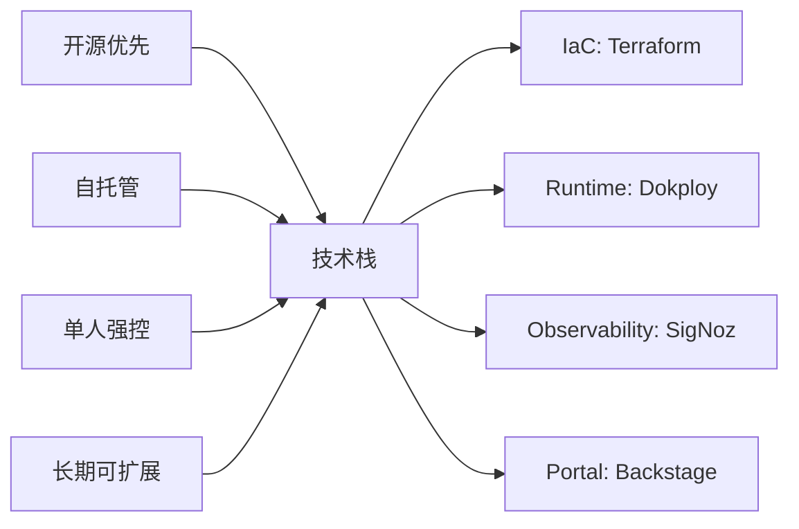
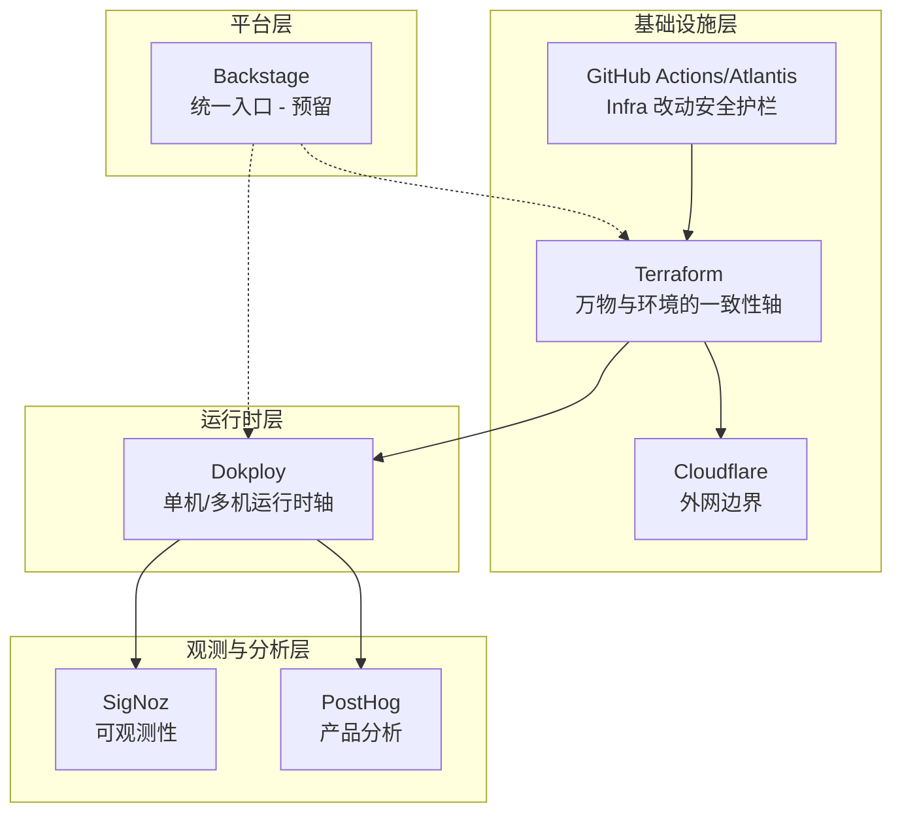

# BRN-004: 开发/测试/生产环境基础架构设计理念

> **文档类型:** Business Requirements & Design Rationale  
> **版本:** 1.0  
> **最后更新:** 2025-12-02  
> **相关文档:** [IRD-004](../specs/infra/IRD-004.dev_test_prod_infra.md) | [TRD-004](../specs/tech/TRD-004.dev_test_prod_implementation.md)

## 概述

本文档阐述了基础架构技术选型的核心理念和决策依据。整体架构围绕**「开源、自托管、单人强控、长期可扩展」**四个核心约束,选择最小但有成长空间的技术组合。

### 核心设计原则

### 技术栈快速对比

| 类别 | 选择方案 | 主要替代方案 | 选择理由 |
|------|---------|------------|---------|
| **IaC 平台** | Terraform | Pulumi, Crossplane | Provider 生态最全,事实标准 |
| **运行时编排** | Dokploy | Kubernetes, Docker Swarm | 单VPS友好,渐进式扩展 |
| **可观测性** | SigNoz | Grafana Stack, Datadog | 一体化 APM,OTel 原生 |
| **开发者门户** | Backstage | Port, Humanitec | 开源,高度可编程 |
| **网络层** | Cloudflare | AWS CloudFront, Nginx | DNS/CDN/WAF 一体化 |
| **产品分析** | PostHog | Mixpanel, Amplitude | 开源自托管,功能完整 |
| **CI/CD** | GitHub Actions + Atlantis | GitLab CI, Terraform Cloud | 轻量,严格权限控制 |

---

## 组件选型详解

### 1. Terraform - IaC 栈核心

**定位角色**

把 VPS、Cloudflare、托管 DB、SigNoz/PostHog 等所有基础设施与外部资源统一声明为代码,作为环境一致性的底座。

**为什么选择 Terraform**

Provider 生态极全,几乎所有需要管理的资源都有官方/社区 Provider,是 IaC 领域的事实标准。高度契合 "Portal + PR + IaC" 的平台工程模式。

**核心优势**

| 优势维度 | 具体内容 | 参考资料 |
|---------|---------|---------|
| **统一管理** | 一门语言管理所有 infra: VPS、Cloudflare、DB、对象存储等 | [[1]][1], [[2]][2] |
| **PR 工作流** | 自然融入 GitHub PR 流程,可配合 Atlantis/Actions 进行 plan/apply 和审批 | [[3]][3], [[4]][4] |
| **平台集成** | 与 Backstage/平台工程模式高度契合,Portal 只需修改 tf 文件即可 | [[1]][1] |

**主要限制**

| 限制维度 | 具体内容 | 参考资料 |
|---------|---------|---------|
| **状态管理** | 状态管理和多环境结构需要自己设计 (state backend、module 边界等) | [[5]][5], [[6]][6] |
| **误操作风险** | 语法/逻辑错误会直接修改真实基础设施,必须配合严格的 PR + plan 流程 | - |
| **K8s 原生性** | 与 Crossplane/Pulumi 相比,Kubernetes 原生性略弱,但当前更看重生态广度 | - |

> [!IMPORTANT]
> Terraform 是整个架构的"一致性轴",所有环境配置变更必须通过 Terraform 进行。

---

### 2. Dokploy - 运行时平台 / PaaS

**定位角色**

单机/多机容器平台,负责运行业务服务、DB 容器、平台工具 (Backstage、PostHog、SigNoz 等),替代手工编写 systemd/docker-compose。

**为什么选择 Dokploy**

已经在使用且体验良好,非常适合 "单 VPS → 多 VPS" 的渐进路径。对于不想一开始就上 K8s、但又需要 UI 和 GitOps 的个人/小团队场景非常契合。

**核心优势**

| 优势维度 | 具体内容 | 参考资料 |
|---------|---------|---------|
| **自托管 PaaS** | 部署在 VPS 上即可,提供 UI、Git 集成、证书/域名管理等功能 | [[7]][7], [[9]][9] |
| **横向扩展** | 支持多 server 管理,后期可以横向扩机器,无需立即迁移到 Kubernetes | [[10]][10] |
| **GitOps 友好** | 可被 "降级" 为 Git/CI 驱动的 runtime,不再依赖手动点击 UI | [[11]][11] |

**主要限制**

| 限制维度 | 具体内容 | 参考资料 |
|---------|---------|---------|
| **非标准 K8s** | 不是标准 K8s,长远如果需要复杂调度/多租户,可能需要迁移 | - |
| **社区规模** | 社区/生态体量小于 Kubernetes 栈,很多玩法需要自己摸索 | - |
| **IaC 集成** | 与 Terraform 的集成主要通过 API/脚本,而非成熟 Provider | [[12]][12] |

> [!TIP]
> Dokploy 适合作为 Kubernetes 之前的过渡方案,在保持简单的同时提供足够的扩展能力。

---

### 3. SigNoz - 可观测性全家桶

**定位角色**

统一处理应用的指标、日志、Trace、异常和告警,相当于自托管 Datadog 的开源替代方案。

**为什么选择 SigNoz**

开箱即用的一体化 APM + 观测平台,比自己组装 Grafana + Prometheus + Loki + Tempo + Alertmanager 简单很多。OpenTelemetry 原生支持,匹配未来所有新服务的统一打点方案。

**核心优势**

| 优势维度 | 具体内容 | 参考资料 |
|---------|---------|---------|
| **一体化体验** | 单 UI 查看 metrics+logs+traces,trace 与 log 关联、 服务拓扑、p95/p99 等 APM 体验完整 | [[16]][16], [[15]][15] |
| **OTel 原生** | OpenTelemetry 原生支持,后续任何语言/服务接入成本低 | [[17]][17], [[18]][18] |
| **部署灵活** | 支持 Docker/K8s 部署,容易先单机后扩展, 对个人 infra 实验性价比高 | [[13]][13], [[15]][15] |

**主要限制**

| 限制维度 | 具体内容 | 参考资料 |
|---------|---------|---------|
| **生态成熟度** | 生态和成熟度略低于 Grafana 栈,特别是异构数据源方面 | [[19]][19], [[20]][20] |
| **运维经验** | 大规模场景下的运维经验主要在社区文档和博客里,需要自己探索 | - |
| **功能范围** | 不内置配置中心,只负责观测, 平台层 (OpenChoreo 或 Backstage) 仍需额外考虑 | [[21]][21], [[14]][14] |

---

### 4. Backstage - 统一入口 / Portal

**定位角色**

"配置与环境全家桶" 的入口: 服务目录、环境目录、资源目录 + 自助模板动作,作为对接 Terraform、Dokploy、Cloudflare 等的 orchestrator。

**为什么选择 Backstage 而不是 OpenChoreo**

已经选好了底座 (Dokploy、Terraform、SigNoz、Cloudflare),需要的是一个高度可编程的 Portal,而不是再来一套 opinionated 平台骨架。Backstage 是开源领域唯一成熟的通用开发者门户框架。

**核心优势**

| 优势维度 | 具体内容 | 参考资料 |
|---------|---------|---------|
| **软件目录** | Service / Environment / Resource 目录、 模板 (Scaffolder) 和 TechDocs 能把所有资源挂在统一 UI | [[24]][24], [[25]][25] |
| **插件生态** | 对接 K8s/ArgoCD/GitHub 等的插件生态成熟,同类开源竞品几乎没有 | - |
| **模式契合** | 与 "Portal 驱动 Terraform/Dokploy/CI" 的模式天然契合, 只需编写少量插件和模板 | [[26]][26], [[27]][27] |

**主要限制**

| 限制维度 | 具体内容 | 参考资料 |
|---------|---------|---------|
| **初始投入** | 框架型产品,初始工作量大,需要自建前后端、插件、权限 | [[28]][28] |
| **插件覆盖** | 对 Cloudflare、Dokploy 等没有官方插件, 需要通过 Terraform/CI 或编写自定义插件 | - |
| **长期资产** | 对个人而言是 "长期资产",短期投入不小, 但有工程能力时这反而是优势而非阻力 | - |

> [!NOTE]
> Backstage 可以作为预留组件,初期可以不部署,待平台成熟后再引入。

---

### 5. Cloudflare - 外围网络 / DNS / CDN

**定位角色**

全局 DNS、CDN、WAF、证书终结点,让本地/单 VPS 也能拥有 "大厂级别" 的边界防护与域名管理能力。

**为什么配合 Terraform 使用**

希望实现 "环境与资源一体化",Cloudflare 作为最核心的外部资源,最适合放入 Terraform 并由 PR 流程管理。

**核心优势**

| 优势维度 | 具体内容 | 参考资料 |
|---------|---------|---------|
| **功能丰富** | 提供丰富的 DNS+CDN+安全功能,无需自己维护 SLB/WAF | - |
| **声明式管理** | 官方 Terraform Provider 支持声明式管理所有记录/规则, 环境间复制简单 | [[29]][29] |
| **动态路由** | 未来扩展到多 VPS、多 region 时, 只需修改 Terraform 记录即可动态调整流量路由 | - |

**主要限制**

| 限制维度 | 具体内容 |
|---------|---------|
| **调试复杂度** | 调试 "真实请求路径" (Cloudflare → VPS) 时需要多一层心智负担 |
| **配置注意** | TLS/证书终结点放在 Cloudflare 时,需要注意 origin 配置、Zero Trust 等 |
| **迁移成本** | 深度绑定后,迁移到其它 DNS/CDN 提供商成本略高 |

---

### 6. PostHog - 产品分析全家桶

**定位角色**

事件埋点、漏斗分析、A/B 实验等产品工具,作为产品指标和行为分析平台。

**为什么选择 PostHog**

已经自托管或计划使用,完全面向开发者,开源、自托管能力强,与 "全堆栈都可控" 的理念非常契合。

**核心优势**

| 优势维度 | 具体内容 |
|---------|---------|
| **开源自托管** | 能在 Dokploy/VPS 或独立机器上运行,数据完全控制在自己手中 |
| **功能完整** | 提供事件、漏斗、实验、session replay 等功能,有助于产品验证 |
| **多语言 SDK** | SDK 支持多语言,容易在 app 仓库中通过 env 配置集成 |

**主要限制**

| 限制维度 | 具体内容 |
|---------|---------|
| **独立系统** | 与 SigNoz、Grafana 等观测系统不直接整合,需要管理额外的控制台 |
| **运维成本** | 自托管需要考虑存储、备份、升级等运维成本 |
| **资源竞争** | 大量事件时需要规划资源,可能与业务服务争抢单机资源 |

---

### 7. Atlantis / GitHub Actions - Terraform 执行平台

**定位角色**

将 Terraform 从 "本地命令" 升级为 "PR 驱动、有审计的 infra pipeline",让所有基础设施变更可审可控。

**为什么选择 Atlantis + GitHub Actions**

非常贴合 "单人、严格权限控制" 的模型: 只需要一个接收 GitHub webhook 的服务和少量 Actions,就能把 plan/apply 收敛到 PR 评论中。

**核心优势**

| 优势维度 | 具体内容 | 参考资料 |
|---------|---------|---------|
| **强制审查** | 任何 Terraform 改动都必须先 PR + plan, 在 PR 上查看 diff 再 apply,极大降低误操作风险 | [[3]][3] |
| **轻量部署** | 不需要额外引入 Terraform Cloud/Spacelift 等 SaaS | - |
| **安全控制** | 配合 GitHub private repo,密钥/状态始终在自己控制下 | [[31]][31], [[32]][32] |

**主要限制**

| 限制维度 | 具体内容 | 参考资料 |
|---------|---------|---------|
| **自主维护** | 需要自己维护 Atlantis 服务或编写 Actions pipeline | - |
| **基础 UI** | 不提供高级 UI,主要是将 plan/apply 输出贴回 PR | - |
| **安全前提** | 安全前提: 不接受外部 PR,不滥用第三方 Actions,否则会增加攻击面 | [[31]][31], [[33]][33] |

> [!WARNING]
> 必须严格控制 GitHub Actions 权限,避免第三方 Actions 带来的安全风险。

---

## 不选方案对比

### 为什么不选这些方案

| 方案类别 | 具体方案 | 不选理由 | 参考资料 |
|---------|---------|---------|---------|
| **全托管 IDP** | Port, Humanitec 等 | 闭源 + 收费,不符合 "必须开源、自控 infra" 的硬约束 | [[34]][34], [[35]][35] |
| **完整平台** | OpenChoreo | 已经选好了底座,OpenChoreo 会强制整套骨架 (Envoy/Vault/OpenSearch 等),与现有技术栈重叠 | [[36]][36], [[37]][37] |
| **Grafana 栈** | Grafana + Prometheus + Loki + Tempo | 虽然生态更大,但更看重 "少组件、一体化 APM" SigNoz 更符合 "个人平台实验 + OTel 收口" 的需求 | [[15]][15], [[19]][19] |
| **Secrets 管理** | Infisical, Vault 等 | 在 "单人、极强控制" 前提下, 密钥集中放 infra tfvars 已满足需求, secrets 平台是未来的增强组件而非当前必需品 | [[31]][31], [[38]][38] |

---

## 架构组合总结

整体技术栈的核心职责划分:

### 核心价值主张

这一组合在约束条件下 (**单人、开源、自托管、长期可扩展**) 非常稳健:

- ✅ **短期**: 能在一台 VPS 上完整运行
- ✅ **中期**: 可以渐进式扩展数据层和观测层
- ✅ **长期**: 只需修改 infra 仓库和 Terraform 配置,就能拆分组件到多机/多 region
- ✅ **应用无感**: App 仓库和运行方式基本不需要重写

---

## 参考资料

### Platform Engineering & IaC
- [1]: [Platform Engineering Tools - Spacelift][1]
- [2]: [Terraform Application Tutorials - HashiCorp][2]
- [3]: [Atlantis Terraform Tutorial - Spacelift][3]
- [4]: [Terraform Atlantis Security Guide - Scalr][4]
- [5]: [Terraform and Kubernetes - Commvault][5]
- [6]: [Terraform Best Practices - Reddit][6]

### Dokploy
- [7]: [Dokploy Official Site][7]
- [8]: [Dokploy PaaS - LinkedIn][8]
- [9]: [Deploy Dokploy on UpCloud][9]
- [10]: [Dokploy Multi-Server Deployments][10]
- [11]: [Dokploy Providers][11]
- [12]: [Dokploy IaC Integration Discussion][12]

### SigNoz
- [13]: [SigNoz Official Site][13]
- [14]: [Enterprise Observability - SigNoz][14]
- [15]: [SigNoz with ClickHouse and OTel][15]
- [16]: [Open Source Observability - SigNoz][16]
- [17]: [SigNoz GitHub][17]
- [18]: [SigNoz Launch Week 4][18]
- [19]: [Grafana vs SigNoz Comparison][19]
- [20]: [SigNoz Alternatives 2025][20]
- [21]: [Observability vs Visibility - SigNoz][21]

### Backstage & Developer Portals
- [22]: [Backstage Official Site][22]
- [23]: [Best IDP Tools 2025][23]
- [24]: [What is Backstage][24]
- [25]: [Platform Engineering with Backstage][25]
- [26]: [Backstage.io - Platform Engineering][26]
- [27]: [Top Backstage Plugins 2025][27]
- [28]: [Developer Portals Tools Guide][28]

### Cloudflare & DNS
- [29]: [Platform Tooling Landscape - Okteto][29]
- [30]: [DNS Automation with ExternalDNS][30]

### Security & Actions
- [31]: [GitHub Actions Security Best Practices][31]
- [32]: [GitHub Security Best Practices - Polymer][32]
- [33]: [GitHub Actions Vulnerabilities - Cycode][33]

### Alternatives & Comparisons
- [34]: [Top Backstage Alternatives - Port][34]
- [35]: [Portals vs Platform Orchestrator - Humanitec][35]
- [36]: [OpenChoreo GitHub][36]
- [37]: [OpenChoreo Architecture][37]
- [38]: [GitHub Actions Secrets][38]

[1]: https://spacelift.io/blog/platform-engineering-tools
[2]: https://developer.hashicorp.com/terraform/tutorials/applications
[3]: https://spacelift.io/blog/atlantis-terraform-tutorial
[4]: https://scalr.com/learning-center/comprehensive-security-guide-for-terraform-atlantis-in-production/
[5]: https://www.commvault.com/explore/terraform-and-kubernetes
[6]: https://www.reddit.com/r/Terraform/comments/1h13ole/best_practices_for_infrastructure_and_deployment/
[7]: https://dokploy.com
[8]: https://www.linkedin.com/posts/sriranjan-kapilan-4772351bb_dokploy-a-self-hosted-paas-for-developers-activity-7350192278394613762-Q8OY
[9]: https://upcloud.com/resources/tutorials/deploy-run-dokploy-upcloud-cloud-servers/
[10]: https://docs.dokploy.com/docs/core/multi-server/deployments
[11]: https://docs.dokploy.com/docs/core/providers
[12]: https://github.com/Dokploy/dokploy/issues/1555
[13]: https://signoz.io
[14]: https://signoz.io/guides/enterprise-observability/
[15]: https://clickhouse.com/blog/signoz-observability-solution-with-clickhouse-and-open-telemetry
[16]: https://signoz.io/blog/open-source-observability/
[17]: https://github.com/SigNoz/signoz
[18]: https://signoz.io/blog/launch-week-4-recap/
[19]: https://www.taloflow.ai/guides/comparisons/grafana-vs-signoz-apm-observability
[20]: https://www.dash0.com/comparisons/best-signoz-alternatives-2025
[21]: https://signoz.io/guides/observability-vs-visibility/
[22]: https://backstage.io
[23]: https://dev.to/samlongbottom/best-internal-developer-platform-idps-tools-in-2025-1918
[24]: https://backstage.io/docs/overview/what-is-backstage/
[25]: https://www.infracloud.io/blogs/starting-platform-engineering-journey-backstage/
[26]: https://platformengineering.org/tools/backstage-io-spotify
[27]: https://stackgen.com/blog/top-backstage-plugins-for-infrastructure-automation-2025-edition
[28]: https://atmosly.com/knowledge/top-tools-for-developer-portals-in-2025-complete-guide
[29]: https://www.okteto.com/blog/platform-tooling-landscape/
[30]: https://komodor.com/blog/simplifying-dns-automation-with-externaldns-and-cert-manager/
[31]: https://www.stepsecurity.io/blog/github-actions-security-best-practices
[32]: https://www.polymerhq.io/blog/cloud-security/github-security-best-practices-you-need-to-know/
[33]: https://cycode.com/blog/github-actions-vulnerabilities/
[34]: https://www.port.io/blog/top-backstage-alternatives
[35]: https://humanitec.com/portals-vs-platform-orchestrator
[36]: https://github.com/openchoreo/openchoreo
[37]: https://openchoreo.dev/docs/overview/architecture/
[38]: https://docs.github.com/en/actions/concepts/security/secrets