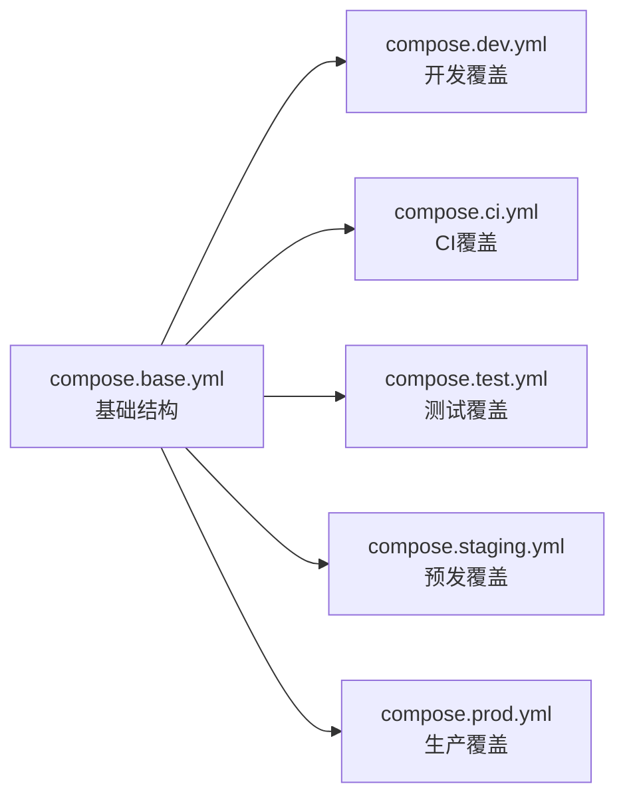
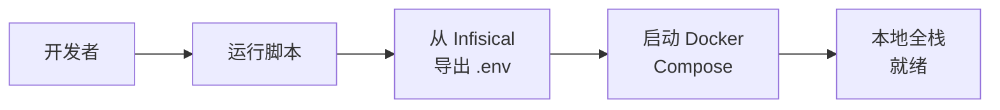
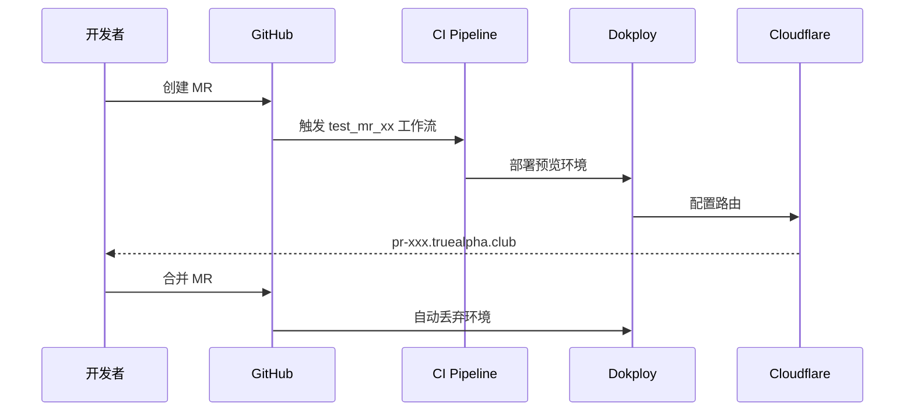
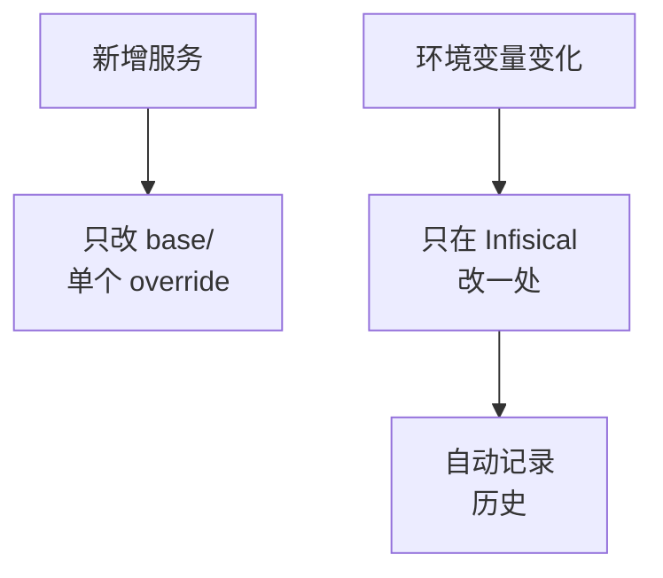

# BRN-007: 应用开发/测试/生产环境机制

> **文档类型:** Business Requirements & Design Rationale  
> **版本:** 1.0  
> **最后更新:** 2025-12-02  
> **前身:** 原 BRN-004 (已重命名)
> **相关文档:** [IRD-007](../specs/infra/IRD-007.app_env_infra.md) | [TRD-007](../specs/tech/TRD-007.app_env_implementation.md)

## 总体目标

用 Git + Docker Compose 管结构，用 Infisical 管所有环境变量，让 5 套环境（dev/ci/test/staging/prod）都能一键起、自动化部署，同时保持配置只有一个真理源。

**核心原则：**
- 代码库是公开 monorepo，包含应用代码和一套通用的 Docker Compose 模板
- 不包含任何真实密钥
- 所有敏感配置和各环境差异都集中放在自托管的 Infisical 中
- dev/ci 要一键跑起来

---

## 配置与 SSOT

应用只通过环境变量读取配置，不关心这些变量从哪里来，从而让"谁提供变量"这件事完全交给 Infisical 和启动脚本。

**配置来源：**
- **本地/CI**：可以用默认值或从 Infisical 导出的 `.env` 文件
- **test/staging/prod**：强制从 Infisical 导出当前版本，保证所有运行时配置都来自同一个中心

> [!IMPORTANT]
> 所有环境的配置都必须经过 Infisical，确保版本历史和回滚能力 [3]

---

## Docker 与环境划分

仓库下有一个 `compose.base.yml` 描述所有环境共有的服务结构，再为 dev/ci/test/staging/prod 各有一个小的 override 文件。

**分层策略：**



**覆盖文件只包含：**
- 端口映射差异
- 卷挂载策略
- Traefik 路由配置
- 是否启动本地 DB

**统一启动命令：**
```bash
docker compose -f base -f ${ENV}.yml --env-file .env.${ENV} -p app-${ENV} up
```

这种固定命令把"结构差异"和"参数差异"清晰分层，减少复制粘贴和配置漂移。

---

## 部署与 MR 流程

### 本地开发 (dev)



- 脚本先从 Infisical 导出 dev 环境变量到 `.env`
- 用 dev 的 Compose 覆盖文件起全栈（包括 Neo4j/Postgres）
- 实现一键 demo/测试环境

### CI 环境

- 用 `.env` 文件起轻量依赖跑测试
- 保证本地和线上的强一致
- 用完就丢，追求速度
- 尽快测试所有代码

### Test 环境 (PR 预览)



- MR 合并请求额外触发一个"预览环境"工作流 `test_mr_xx`
- 通过 Traefik + Cloudflare 给出 `pr-xxx.truealpha.club` 供手工验证
- 代码合并之后自动丢弃环境和数据

### Staging 环境

- 定期 dump 生产数据到 staging
- 提供和线上高度相似的环境
- 用于 post-merge 测试
- 持久化环境

### Prod 环境

- 通过 Infisical 提供的正式连接串连到共享数据库和 Neo4j
- 最严格的变更流程
- 完整的回滚机制

**流程说明：**
- 大部分需求是逐级开发的 (dev → test → staging → prod)
- 少部分可以通过 bot 打标，直接部署到 staging

---

## 为什么维护成本低

### 单点修改



**核心优势：**

1. **结构变更**：只动 base/单个 override 文件
2. **参数变更**：只在 Infisical 改一处并自动记录历史
3. **不再到处翻** `.env` 或 Dokploy 面板

### 可审查与回滚

所有环境的最终配置都可以通过：
- `docker compose config` 查看合并后的配置
- Infisical 的版本历史审查与回滚

**快速定位问题：**
- 是"结构错"？→ 查看 Compose 文件
- 还是"参数错"？→ 查看 Infisical 历史

长期维护成本稳定可控。

---

## 环境对比矩阵

| 环境 | 触发方式 | 数据源 | 域名示例 | 生命周期 | 用途 |
|-----|---------|--------|---------|---------|------|
| **dev** | 手动 | 本地容器 | localhost | 持久 | 日常开发 |
| **ci** | PR/Push | 临时容器 | - | 分钟级 | 自动化测试 |
| **test** | PR 创建 | 临时 | pr-123.truealpha.club | PR 关闭销毁 | 人工验证 |
| **staging** | 定期/手动 | prod dump | staging.truealpha.club | 持久 | 预发测试 |
| **prod** | merge main | 正式数据 | truealpha.club | 持久 | 线上服务 |

---

## 技术选型

| 组件 | 选型 | 理由 |
|-----|------|------|
| **配置管理** | Infisical (自托管) | 版本历史、回滚、团队权限、免费 |
| **容器编排** | Docker Compose | 简单、够用、学习成本低 |
| **部署平台** | Dokploy | 已有基础设施，支持 Compose |
| **反向代理** | Traefik | Dokploy 内置，自动 SSL |
| **CI/CD** | GitHub Actions | 原生集成，免费额度 |

---

## 数据隔离策略

### Label 前缀机制

```python
# libs/neo4j_repo/connection.py
settings.prefixed_label("Company")
# dev: dev_Company
# prod: prod_Company
```

**关键变量：**

| 变量 | 作用 | 环境差异 |
|-----|------|---------|
| `PEG_ENV` | 控制 DEBUG 开关 | dev=development, prod=production |
| `DB_TABLE_PREFIX` | Neo4j Label 前缀隔离 | dev_, test_, prod_ |
| `NEO4J_URI/USER/PASSWORD` | 数据库连接 | 按环境不同 |

**风险缓解：**
- Repository 层封装
- 单元测试校验
- 代码审查确保前缀使用

---

## 安全设计

| 风险 | 措施 |
|-----|------|
| **密钥泄露** | Infisical 加密存储，绝不进 Git |
| **环境混淆** | `PEG_ENV` 强制校验，Label 前缀隔离 |
| **预览环境暴露** | Cloudflare Access 保护 |
| **.env 文件泄露** | 加入 `.gitignore`，只提交 `.env.example` |

---

## 参考资料

- [1]: [CSDN - Docker Compose 多环境管理][1]
- [2]: [CSDN - Infisical 配置管理实践][2]
- [3]: [CSDN - 环境变量版本控制][3]
- [4]: [GitHub - Awesome Stars Collection][4]

[1]: https://blog.csdn.net/gitblog_00723/article/details/147291579
[2]: https://blog.csdn.net/gitblog_00377/article/details/148375070
[3]: https://blog.csdn.net/Mrex326428/article/details/141426852
[4]: https://github.com/svg153/awesome-stars
