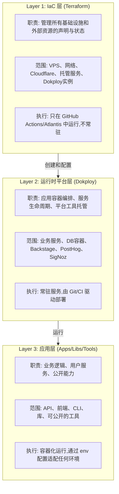
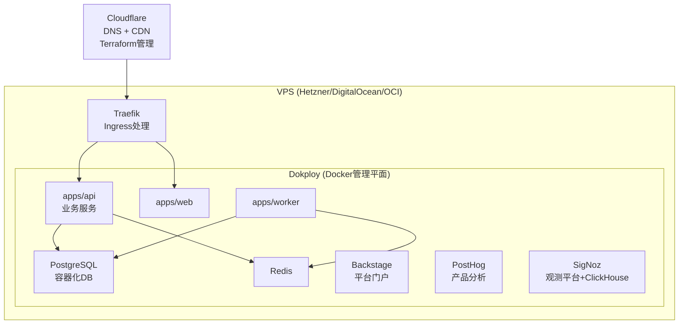
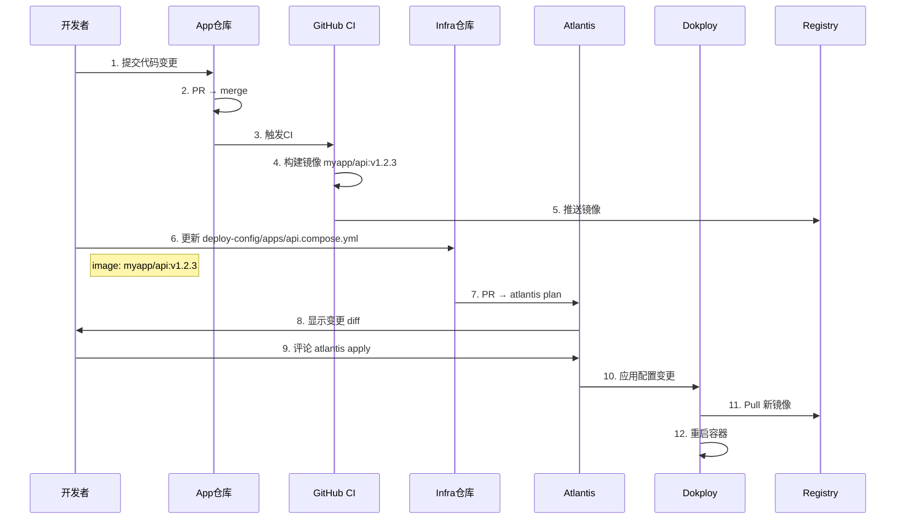
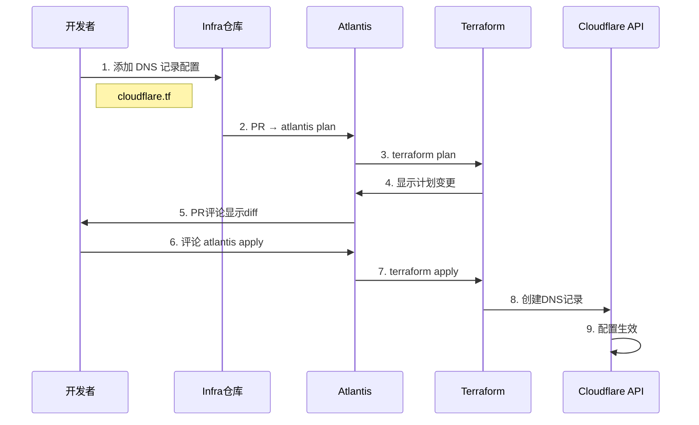

# IRD-004: 开发/测试/生产环境基础设施设计

> **文档类型:** Infrastructure & Repository Design  
> **版本:** 1.0  
> **最后更新:** 2025-12-02  
> **相关文档:** [BRN-004](../../origin/BRN-004.dev_test_prod_design.md) | [TRD-004](../tech/TRD-004.dev_test_prod_implementation.md)

## 概述

本文档详细描述了开发/测试/生产环境的完整系统设计,包括三层架构定位、仓库结构、组件清单、扩展路径和工作流程。

## 目录

- [一、三层架构定位](#一三层架构定位)
- [二、仓库目录结构](#二仓库目录结构)
- [三、单VPS起步 → 长期扩展路径](#三单vps起步--长期扩展路径)
- [四、组件清单:代码位置 & 部署位置](#四组件清单代码位置--部署位置)
- [五、场景与约束满足度分析](#五场景与约束满足度分析)
- [六、数据备份策略](#六数据备份策略)
- [七、工作流示例](#七工作流示例)
- [八、安全性总结](#八安全性总结)
- [九、迁移路径](#九迁移路径)
- [十、总评:简单程度](#十总评简单程度)

---

## 一、三层架构定位



**依赖关系：单向向下**
- Layer 3 不知道 Dokploy，只依赖标准env
- Layer 2 读取 Layer 1 创建的资源（VPS、网络、外部服务）
- Layer 1 不依赖任何上层，只声明"应该有什么"

***

## 二、仓库目录结构

### App 仓库 (Public - `myproject/`)

```
myproject/                    # 遵循 nx monorepo
├── apps/
│   ├── api/                  # 后端服务
│   │   ├── src/
│   │   ├── Dockerfile
│   │   └── .env.example      # 示例配置（假值）
│   ├── web/                  # 前端
│   │   ├── src/
│   │   ├── Dockerfile
│   │   └── .env.example
│   └── worker/               # 异步任务
│       ├── src/
│       ├── Dockerfile
│       └── .env.example
├── libs/                     # 共享库
│   ├── shared-utils/
│   └── api-client/
├── tools/                    # CLI工具、脚本
│   └── dev-setup/
├── docker-compose.dev.yml    # 本地开发一键启动
├── .env.example              # 全局env示例
├── nx.json
├── package.json
└── README.md                 # 包含"如何本地启动"文档
```

**核心原则：**
- 所有env只有key名 + 示例值，真值不入库
- 本地运行：`npm run dev` → docker-compose.dev.yml 起本地DB+服务
- 不依赖Dokploy、不绑定infra

***

### Infra 仓库 (Private - `infra/`)

```
infra/
├── terraform/                     # 所有 IaC
│   ├── modules/                   # 可复用模块
│   │   ├── vps/                   # VPS创建模块
│   │   ├── cloudflare-zone/      # Cloudflare资源
│   │   ├── dokploy-instance/     # Dokploy安装脚本
│   │   └── signoz/                # SigNoz部署模块
│   ├── environments/              # 环境配置
│   │   ├── dev/
│   │   │   ├── main.tf
│   │   │   ├── terraform.tfvars  # dev专用变量+密钥
│   │   │   └── backend.tf
│   │   ├── test/
│   │   └── prod/
│   │       ├── main.tf
│   │       ├── terraform.tfvars  # prod真实密钥在这
│   │       └── backend.tf
│   └── shared/                    # 跨环境共享配置
│       └── providers.tf
│
├── deploy-config/                 # Dokploy部署定义
│   ├── apps/
│   │   ├── api.compose.yml       # 引用app仓库镜像
│   │   ├── web.compose.yml
│   │   └── worker.compose.yml
│   ├── platform/
│   │   ├── backstage.compose.yml
│   │   ├── posthog.compose.yml
│   │   └── signoz.compose.yml
│   └── env/                       # 环境差异配置
│       ├── dev.env               # 非敏感默认值
│       ├── prod.env              # 只存引用，真值在tfvars
│       └── secrets.template      # 密钥key列表
│
├── backstage/                     # Backstage配置
│   ├── app-config.yaml
│   ├── catalog/
│   │   ├── services.yaml         # Service目录
│   │   ├── environments.yaml     # dev/test/prod定义
│   │   └── resources.yaml        # Cloudflare/DB等
│   └── plugins/
│
├── scripts/                       # 运维脚本
│   ├── backup-db.sh
│   ├── restore-db.sh
│   └── rotate-secrets.sh
│
├── services/                      # 不开源的私有服务
│   └── internal-crawler/         # 爬虫等敏感业务逻辑
│       ├── src/
│       ├── Dockerfile
│       └── compose.yml
│
├── .github/
│   └── workflows/
│       ├── terraform-plan.yml    # PR时自动plan
│       ├── terraform-apply.yml   # 评论触发apply
│       └── deploy-apps.yml       # 应用部署
│
├── atlantis.yaml                  # Atlantis配置
└── README.md
```

**核心原则：**
- 所有真实密钥在 `terraform/environments/*/terraform.tfvars`
- Terraform和Dokploy配置引用同一份密钥
- 私有业务代码可以放 `services/`

***

## 三、单VPS起步 → 长期扩展路径

### 当前架构 (单VPS)



### 长期扩展路径

**阶段1: 数据层拆分 (3-6个月)**
- PostgreSQL → 托管DB (Neon/Aiven)，Terraform管理
- Redis → Upstash/托管Redis
- 仍然单VPS跑应用

**阶段2: 观测独立 (6-12个月)**
- SigNoz → 独立VPS或K8s，处理高基数traces
- PostHog → 迁移到PostHog Cloud或独立机器

**阶段3: 应用水平扩展 (12个月+)**
- 多VPS + 负载均衡，Terraform管理VPS池
- 或迁移到K8s (保持Terraform管IaC，换掉Dokploy用Argo)

**扩展时不变的：**
- Terraform继续管所有基础设施
- App仓库代码不变，只改infra仓库配置
- 两仓库结构保持，只在terraform里增加资源

***

## 四、组件清单：代码位置 & 部署位置

| 组件 | 代码仓库 | 代码路径 | 部署位置 | 运行方式 | 依赖 |
|------|---------|---------|---------|---------|------|
| **业务服务** |
| API | app (public) | `apps/api/` | VPS/Dokploy | Docker容器 | DB, Redis, SigNoz |
| Web | app (public) | `apps/web/` | VPS/Dokploy | Docker容器 | API |
| Worker | app (public) | `apps/worker/` | VPS/Dokploy | Docker容器 | DB, Redis, 队列 |
| 私有爬虫 | infra (private) | `services/internal-crawler/` | VPS/Dokploy | Docker容器 | 代理, S3 |
| **数据层** |
| PostgreSQL | - (官方镜像) | infra: `deploy-config/` | VPS/Dokploy | 容器/Volume | - |
| Redis | - (官方镜像) | infra: `deploy-config/` | VPS/Dokploy | 容器 | - |
| **平台工具** |
| Backstage | infra (private) | `backstage/` | VPS/Dokploy | Node容器 | GitHub, Terraform API |
| Dokploy | - (官方) | infra: `terraform/modules/dokploy-instance/` | VPS | 系统服务 | Docker |
| **观测性** |
| SigNoz | - (官方) | infra: `terraform/modules/signoz/` or `deploy-config/` | VPS/Dokploy | Docker Compose | ClickHouse |
| PostHog | - (官方) | infra: `deploy-config/platform/` | VPS/Dokploy | Docker Compose | PostgreSQL, Redis |
| **基础设施** |
| Terraform | infra (private) | `terraform/` | GitHub Actions/Atlantis | CLI (CI中) | Cloud APIs |
| Cloudflare | - (SaaS) | infra: `terraform/modules/cloudflare-zone/` | Cloudflare网络 | Terraform管理 | - |
| Atlantis | - (官方) | infra根目录 | VPS/Dokploy 或 GitHub Actions | 服务/CI | GitHub webhook |

***

## 五、场景与约束满足度分析

### 核心场景

| 场景/约束 | 要求 | 设计满足方式 | 难度 |
|----------|------|-------------|------|
| **开源 app 仓库** | 代码公开，无敏感信息 | `.env.example` + 假值；真值全在 infra 仓库 | ⭐ |
| **app 本地一键启动** | 开发者无需 infra 仓库即可跑 | `docker-compose.dev.yml` 起本地DB+所有服务 | ⭐ |
| **app 不依赖 Dokploy** | 可在任何容器环境运行 | 只依赖标准 env，Dockerfile 通用 | ⭐ |
| **infra 仓库私有** | 所有密钥、配置、策略隔离 | GitHub private repo + 只你一人权限 | ⭐ |
| **环境一致性** | dev/test/prod 结构相同 | 同一套 Terraform module + 不同 tfvars | ⭐⭐ |
| **外部资源纳管** | Cloudflare/R2 等代码化 | Terraform Cloudflare Provider | ⭐⭐ |
| **配置强一致** | DB密码、API key 等不散落 | 统一在 `terraform/environments/*/terraform.tfvars` | ⭐ |
| **避免手动部署** | 所有改动走 Git + PR | Atlantis 评论触发 Terraform；Dokploy watch Git | ⭐⭐ |
| **单人权限极严格** | 只你能改 | GitHub repo 权限 + 2FA；无外部协作者 | ⭐ |
| **单 VPS 起步** | 初期成本低 | 所有容器跑同一 VPS，Dokploy 管理 | ⭐ |
| **长期可扩展** | 数据/服务可拆分 | Terraform 抽象模块，改 tfvars 即可加资源 | ⭐⭐⭐ |

### 两仓库一致性保证

| 一致性维度 | 实现方式 | 风险点 |
|-----------|---------|--------|
| **版本** | app 仓库打 tag → infra 仓库引用镜像版本 | 需手动/自动更新 infra 中的 image tag |
| **配置 schema** | app 仓库 `.env.example` 定义 key 结构 | infra 必须填全所有 key，否则启动失败（好事） |
| **密钥** | 只在 infra 仓库 tfvars 中存一份 | 改密钥后需同时更新 Terraform 和 Dokploy 配置（可自动化） |
| **依赖服务** | app 仓库文档说明依赖（如 PostgreSQL 14+） | infra 仓库 Terraform 必须创建对应服务 |

**单向依赖确认：**
- ✅ App 仓库 → 不知道 infra 仓库存在
- ✅ Infra 仓库 → 读取 app 仓库（拉镜像、读文档）
- ✅ 服务依赖链：Web → API → DB (单向)

***

## 六、数据备份策略

### 备份范围

| 数据类型 | 位置 | 备份方式 | 难度 | 频率 |
|---------|------|---------|------|------|
| **PostgreSQL** | VPS Volume | `scripts/backup-db.sh` + pg_dump → R2/S3 | ⭐⭐ | 每日自动 |
| **ClickHouse (SigNoz)** | VPS Volume | ClickHouse backup → R2 | ⭐⭐ | 每周 |
| **Terraform State** | S3/R2 | Terraform backend 自带版本控制 | ⭐ | 自动 |
| **Git 仓库** | GitHub | 本地 mirror clone + push 到备份 repo | ⭐ | 每周 |
| **Volume 数据** | Dokploy volumes | Restic/Borg → R2 | ⭐⭐⭐ | 每日 |
| **Secrets** | infra 仓库 tfvars | 加密后备份到私有 S3 | ⭐⭐ | 每次改动 |

### 备份实现（infra仓库）

```bash
# infra/scripts/backup-db.sh
#!/bin/bash
DATE=$(date +%Y%m%d_%H%M%S)
pg_dump $DATABASE_URL | gzip > /tmp/backup_$DATE.sql.gz
aws s3 cp /tmp/backup_$DATE.sql.gz s3://my-backups/postgres/
# 保留30天
aws s3 ls s3://my-backups/postgres/ | awk '{print $4}' | sort | head -n -30 | xargs -I {} aws s3 rm s3://my-backups/postgres/{}
```

**Terraform自动化：**
```hcl
# terraform/modules/backup-job/
resource "null_resource" "backup_cron" {
  provisioner "remote-exec" {
    inline = [
      "echo '0 2 * * * /opt/scripts/backup-db.sh' | crontab -"
    ]
  }
}
```

**难度评估：**
- ⭐ = 一次配置，自动运行
- ⭐⭐ = 需要测试恢复流程，偶尔手动验证
- ⭐⭐⭐ = 需要监控备份成功率，有一定运维负担

***

## 七、工作流示例

### 场景1:发布新版本



**配置示例:**

```yaml
# infra/deploy-config/apps/api.compose.yml
version: '3.8'
services:
  api:
    image: myapp/api:v1.2.3  # 更新版本号
    environment:
      - DATABASE_URL=${DATABASE_URL}
      - REDIS_URL=${REDIS_URL}
    labels:
      - "traefik.enable=true"
      - "traefik.http.routers.api.rule=Host(`api.example.com`)"
```

> [!NOTE]
> 版本号从 app tag 手动复制到 infra,未来可通过 GitHub Actions 实现跨仓库自动化PR）

***

### 场景2:添加 Cloudflare DNS 记录



**配置示例:**

```hcl
# terraform/environments/prod/cloudflare.tf
resource "cloudflare_record" "new_api" {
  zone_id = var.cloudflare_zone_id
  name    = "api"
  value   = var.vps_ip
  type    = "A"
  ttl     = 1  # Auto TTL
  proxied = true  # 启用 Cloudflare CDN
}

resource "cloudflare_record" "api_wildcard" {
  zone_id = var.cloudflare_zone_id
  name    = "*.api"
  value   = var.vps_ip
  type    = "A"
  ttl     = 1
  proxied = true
}
```

> [!TIP]
> VPS IP 作为 Terraform 变量在 `terraform.tfvars` 中统一管理,支持环境间复用

***

### 场景3：本地开发（新同事/贡献者）

1. Clone app 仓库（public）
2. `cp .env.example .env`
3. `npm run dev`  
   → docker-compose.dev.yml 起本地 PostgreSQL + Redis + 所有服务

**完全不需要 infra 仓库** ✅

***

## 八、安全性总结

| 安全层面 | 措施 | 级别 |
|---------|------|------|
| **密钥泄露** | 只在 infra tfvars；app 仓库无真值；GitHub 2FA | 高 |
| **仓库误公开** | Infra 设为 private；定期审查 repo 可见性 | 高 |
| **CI 攻击面** | 只你一人有权限；不跑第三方 Actions | 高 |
| **生产变更** | 所有改动必须 PR + Atlantis plan + 人工确认 | 中-高 |
| **备份加密** | S3/R2 开启加密；tfvars 备份用 GPG 加密 | 中 |
| **网络隔离** | Cloudflare 前置；VPS 防火墙只开必要端口 | 中 |

***

## 九、迁移路径（如果你现在已有服务）

### 当前状态 → 目标状态

**Phase 1: 建仓库结构 (1-2天)**
- 创建 infra 仓库，按上述结构建目录
- 把现有 Dokploy 配置迁移到 `deploy-config/`
- 写第一个 Terraform module（VPS + Cloudflare）

**Phase 2: Terraform 接管基础设施 (1周)**
- 用 `terraform import` 导入现有 VPS
- 用 Terraform 管理 Cloudflare
- 设置 Atlantis 或 GitHub Actions

**Phase 3: 应用GitOps化 (1-2周)**
- App 仓库配置 CI 打镜像
- Dokploy 改为从 Git pull 配置
- 测试完整发布流程

**Phase 4: 加入观测和平台工具 (2-4周)**
- 部署 SigNoz
- 部署 Backstage
- 应用接入 OpenTelemetry

***

## 十、总评：简单程度

| 初始搭建 | 日常使用 | 扩展/维护 |
|---------|---------|----------|
| ⭐⭐⭐ | ⭐ | ⭐⭐ |

- **初始搭建**：需要理解 Terraform、Dokploy、两仓库模型，一次性投入较高
- **日常使用**：一旦跑起来，改代码 → PR → 自动部署，非常流畅
- **扩展/维护**：Terraform module化后扩展相对容易；备份/监控需要定期检查

**建议优先级：**
1. 先跑通 app 本地开发 ⭐
2. 建 infra 仓库 + 基础 Terraform（VPS + Cloudflare）⭐⭐
3. Dokploy GitOps化 ⭐⭐
4. 加入 Atlantis + 完整 CI ⭐⭐⭐
5. 补齐 SigNoz/Backstage/PostHog ⭐⭐

按这个顺序，你可以渐进式迁移，每一步都是可用状态。

Sources
