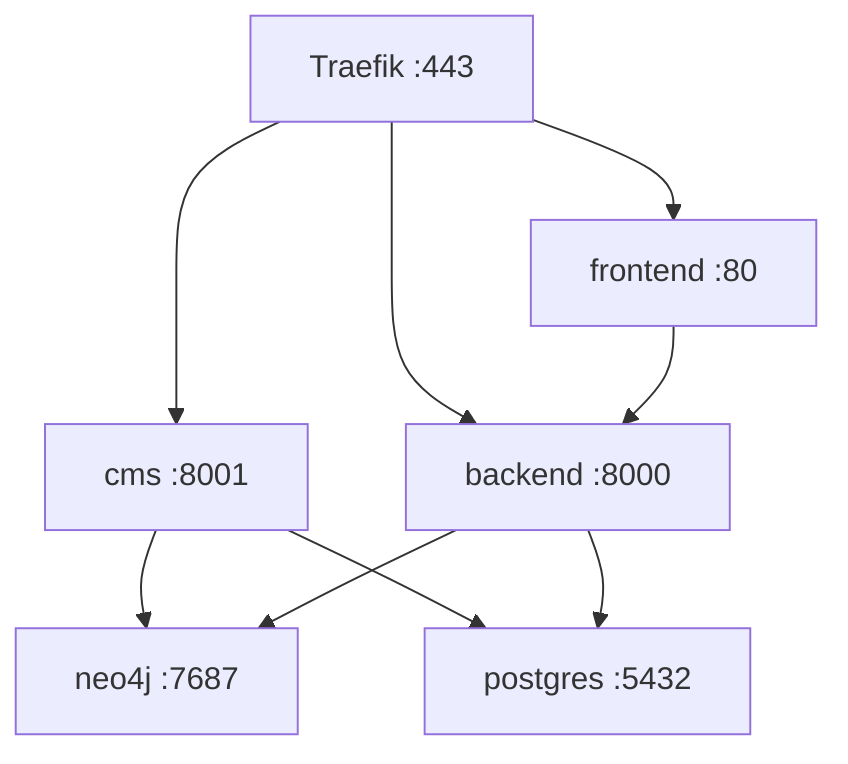
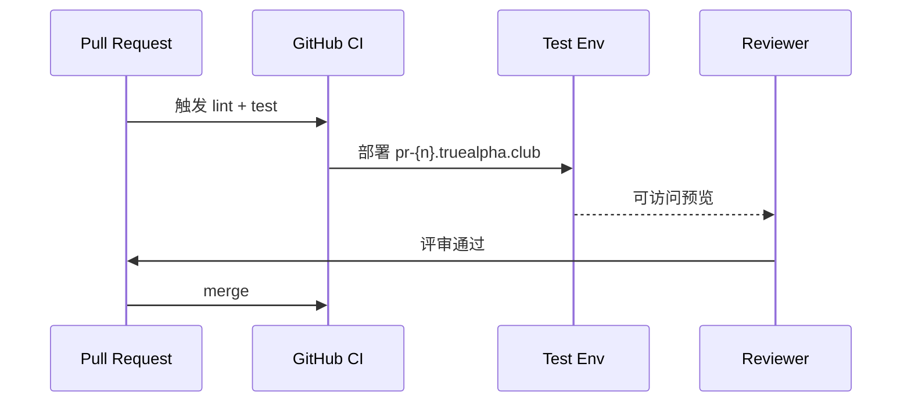

# IRD-007: 应用环境基础设施设计

> **文档类型:** Infrastructure & Repository Design  
> **版本:** 1.0  
> **最后更新:** 2025-12-02  
> **相关文档:** [BRN-007](../../origin/BRN-007.app_env_design.md) | [TRD-007](../tech/TRD-007.app_env_implementation.md)

## 1. 选型决策

| 组件 | 选型 | 理由 |
|------|------|------|
| 配置管理 | **Infisical** (自托管) | 版本历史、回滚、团队权限、免费 |
| 部署平台 | **Dokploy** | 已有基础设施，支持 Compose |
| 反向代理 | **Traefik** | Dokploy 内置，自动 SSL |
| CI | **GitHub Actions** | 原生集成，免费额度 |

## 2. 环境矩阵

| 环境 | 触发 | 数据源 | 域名 | 生命周期 |
|------|------|--------|------|----------|
| **dev** | 手动 | 本地容器 | localhost | 持久 |
| **ci** | PR/Push | 临时容器 | - | 分钟级 |
| **test** | PR 创建 | 临时 | `pr-{n}.truealpha.club` | PR 关闭即销毁 |
| **staging** | 定期/手动 | prod dump | `staging.truealpha.club` | 持久 |
| **prod** | merge main | 正式数据 | `truealpha.club` | 持久 |

## 3. 配置管理设计

### SSOT 原则
- 应用只读 `ENV`，不关心来源
- Infisical 按环境分目录：`dev/` `ci/` `test/` `staging/` `prod/`
- 本地开发用默认值，无需 Infisical 也能跑

### 敏感变量清单
| 变量 | 环境差异 |
|------|----------|
| `NEO4J_PASSWORD` | dev 用默认值，prod 从 Infisical |
| `DATABASE_URL` | dev 本地容器，prod 外部托管 |
| `DJANGO_SECRET_KEY` | 每环境独立 |

## 4. Docker Compose 分层

```
docker-compose.yml          # 生产结构
docker-compose.dev.yml      # 开发覆盖（本地 DB、volume）
docker-compose.override.yml # 个人定制（gitignore）
```

### 一键启动
- **dev**: `npm run dev` → 起 DB 容器 + 应用
- **ci**: Actions 自动处理，用 `tools/docker/docker-compose.infra.yml`
- **prod**: Dokploy webhook 触发 `docker compose up`

### 默认值策略
所有 ENV 在 compose 里写默认值：`${VAR:-default}`，确保无外部依赖也能本地跑。

## 5. 服务拓扑



| 服务 | 容器端口 | 外部路由 |
|------|----------|----------|
| frontend | 80 | `truealpha.club` |
| backend | 8000 | `api.truealpha.club` |
| cms | 8001 | `cms.truealpha.club` |
| neo4j | 7474/7687 | 内部 |
| postgres | 5432 | 内部 |

## 6. CI/CD 流水线

### PR 流程


### 部署流程
```
merge main → build → push registry → Dokploy webhook → health check
```

### PR 预览环境
- 触发：`pull_request.opened/synchronize`
- 命名：`docker compose -p pr-{number}`
- 域名：Traefik 动态路由 `pr-{n}.truealpha.club`
- 清理：PR closed 时 `down -v`

## 7. Staging 数据同步

| 项目 | 策略 |
|------|------|
| 频率 | 每周一次或手动 |
| Neo4j | `neo4j-admin dump` → 传输 → `load` |
| PostgreSQL | `pg_dump` → 脱敏 → `psql` |
| 脱敏字段 | 用户密码、API keys |

## 8. 部署顺序

### 首次部署
```
1. Infisical 配置 → 2. 数据库 (neo4j, postgres) → 3. backend → 4. cms → 5. frontend
```

### 日常更新
| 变更类型 | 顺序 | 说明 |
|----------|------|------|
| 仅前端 | frontend | 无依赖 |
| API 变更 | backend → frontend | 前端依赖后端 |
| Schema 变更 | DB migration → backend → cms → frontend | 全链路 |
| 配置变更 | Infisical → 重启相关服务 | 按依赖顺序 |

### 服务依赖
```
frontend ──depends──▶ backend ──depends──▶ neo4j, postgres
cms ─────────────────────────────depends──▶ neo4j, postgres
```

## 9. 回滚机制

| 类型 | 方式 |
|------|------|
| 配置回滚 | `infisical secrets rollback --version=N` |
| 代码回滚 | `git revert` + 重新部署 |
| 容器回滚 | Dokploy 历史版本重部署 |

## 10. 安全设计

| 风险 | 措施 |
|------|------|
| 密钥泄露 | Infisical 加密存储，不进 Git |
| 环境混淆 | `PEG_ENV` 强制校验，Label 前缀隔离 |
| 预览环境暴露 | Cloudflare Access 保护 |

## 11. 参考

- [Infisical Docs](https://infisical.com/docs)
- [Dokploy Docs](https://dokploy.com/docs)
- [TRD-007: 技术实现](../tech/TRD-007.app_env_implementation.md)
