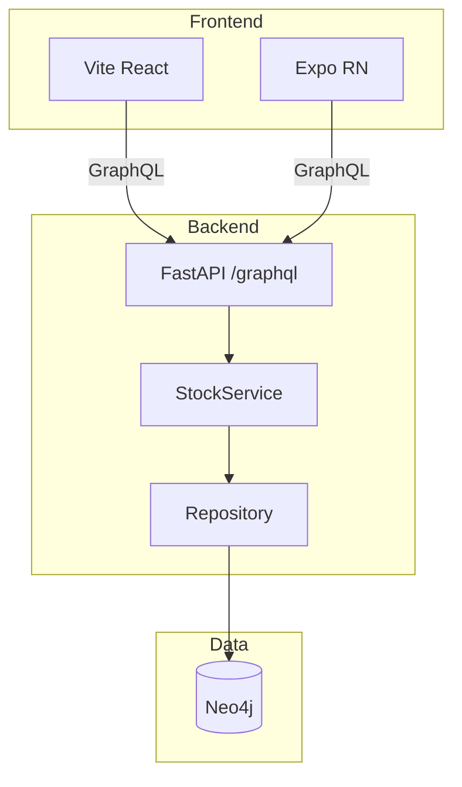

# TRD-001: 核心基建与 Ping（对应 BRN-001）

## 1. 背景与目标
基于 BRN-001 决策，构建可水平扩展的核心基建，验收标准为 ping-pong 通路畅通。

## 2. 技术栈选型对比

| 维度 | 选择方案 | 备选方案 | 选择理由 |
|------|---------|---------|---------|
| 后端框架 | FastAPI + Strawberry | Flask + Ariadne | ASGI 异步、依赖注入、OpenTelemetry 原生支持 |
| 图数据库 | Neo4j | JanusGraph | 生态成熟、Cypher 表达力强、云服务完善 |
| OGM | neomodel (早期) | 手写 Cypher | 加速建模，复杂查询仍用 Cypher，可平滑演进 |
| 容器编排 | Podman Compose (dev) + Dokploy (prod) | Docker Swarm | Podman rootless 安全、Dokploy 简化云端部署 |
| Monorepo | Nx | Turborepo | 插件生态、代码生成、依赖图可视化更强 |

## 3. 架构设计

### 3.1 整体架构


### 3.2 Ping 链路
```
前端 → nginx/Caddy → FastAPI /graphql
                    ↓
                  Query.ping
                    ↓
                  Neo4j (可选健康检查)
```

## 4. 关键接口（伪代码）

### 4.1 GraphQL Schema
```graphql
type Query {
  ping: PingResponse!
}

type PingResponse {
  message: String!
  agent: String!
  timestampMs: Float!
}
```

### 4.2 Resolver 接口
```python
# api/graphql/common/schema.py
@strawberry.type
class Query:
    @strawberry.field
    def ping(self, info: Info) -> PingResponse:
        # 调用 service 层
        return info.context["ping_service"].execute()
```

### 4.3 Service 层
```python
# core/services/ping_service.py
class PingService:
    def execute(self) -> PingResponse:
        # 记录追踪、返回响应
        self.tracking_repo.record_event("ping")
        return PingResponse(message="pong", ...)
```

## 5. 环境管理

### 5.1 环境类型
- **dev**：本地开发，Podman machine，热重载
- **test**：CI 环境，容器化完整栈，回归测试
- **prod**：云端 Dokploy，水平扩容（3+ 实例）

### 5.2 容器化策略
```yaml
# docker-compose.yml (dev/test)
services:
  neo4j:
    image: neo4j:5-community
    ports: ["7474:7474", "7687:7687"]
  
  backend:
    build: ./apps/backend
    volumes: ["./apps/backend/src:/app/src"]
    environment:
      NEO4J_URI: bolt://neo4j:7687
```

## 6. 部署流程

### 6.1 本地开发
```bash
# 启动依赖
podman machine start
docker-compose up -d neo4j

# 启动应用
nx run backend:serve    # uvicorn 热重载
nx run web:serve        # Vite dev server
```

### 6.2 生产部署
```bash
# Dokploy 配置
docker build -t pegscanner-backend .
dokploy deploy --scale=3 --health-check=/graphql
```

## 7. 监控与日志
- **日志目录**：`x-log/`（Agent 不修改）
- **Tracking**：ping 请求计数入 Neo4j `:TrackingEvent` 节点
- **告警**：ping 失败 >3 次触发 Slack 通知

## 8. 验收标准
- ✅ `nx run backend:serve` 启动成功
- ✅ `nx run web:serve` 前端启动成功
- ✅ 前端状态指示器显示绿色（ping 成功）
- ✅ `nx run regression:ping` E2E 测试通过
- ✅ `nx run regression:infra-flow` 基建流程测试通过

## 9. 参考文档
- [BRN-001: 核心基建决策](../../origin/BRN-001.core_infra_ping.md)
- [TRD-002: GraphQL 协议实现](./TRD-002.strawberry_fastapi.md)
- [IRD-001: AI 评分机制](../infra/IRD-001.ai_evaluation.md)

