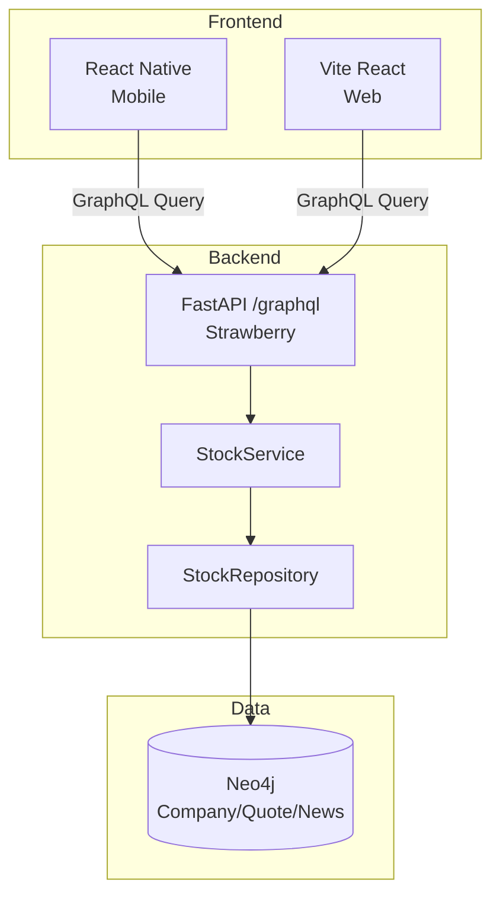

# TRD-003: 个股页面技术设计（对应 BRN-003）

## 1. 背景
基于 PRD-003 产品需求，实现个股信息展示页面的前后端技术方案。

## 2. 整体架构


## 3. GraphQL Schema 设计

### 3.1 Query 定义（伪代码）
```graphql
# libs/schema/market/market.graphql
type Query {
  singleStock(symbol: String!): SingleStockPage
}

type SingleStockPage {
  stock: Stock!
  dailyKline: [KlinePoint!]!
  news: [NewsItem!]!
}

type Stock {
  symbol: String!
  name: String!
  companyInfo: CompanyInfo
}

type CompanyInfo {
  valuation: Valuation
  indicators: Indicators
}
```

### 3.2 Resolver 调用关系
```
Client Query
  → Strawberry Resolver (api/graphql/market/)
    → StockService.get_single_stock_page(symbol)
      → StockRepository.find_company(symbol)
      → StockRepository.fetch_daily_kline(symbol, 30)
      → StockRepository.fetch_news(symbol, 10)
```

## 4. Service 层设计（伪代码）

```python
# core/services/stock_service.py
class StockService:
    def get_single_stock_page(self, symbol: str):
        # 1. 查询公司基础信息
        company = self.repo.find_company(symbol)
        if not company:
            return None
        
        # 2. 并发查询 K线 + 新闻
        kline = self.repo.fetch_daily_kline(symbol, limit=30)
        news = self.repo.fetch_news(symbol, limit=10)
        
        # 3. 组装响应
        return build_response(company, kline, news)
```

## 5. Repository 层（Cypher 查询）

### 5.1 查询公司信息
```python
def find_company(self, ticker: str):
    return Company.nodes.get_or_none(ticker=ticker)
```

### 5.2 查询日 K 线（Cypher）
```cypher
MATCH (c:Company {ticker: $ticker})-[:HAS_QUOTE]->(q:DailyQuote)
RETURN q.date, q.open, q.high, q.low, q.close, q.volume
ORDER BY q.date DESC
LIMIT $limit
```

### 5.3 查询新闻（Cypher）
```cypher
MATCH (c:Company {ticker: $ticker})-[:MENTIONED_IN]->(n:NewsArticle)
RETURN n.title, n.url, n.source, n.publishedAt
ORDER BY n.publishedAt DESC
LIMIT $limit
```

## 6. Neo4j 数据模型（参考 BRN-005）

```cypher
// 节点
(:Company {ticker, name, exchange, sector})
(:DailyQuote {date, open, high, low, close, volume})
(:NewsArticle {title, url, source, publishedAt})

// 关系
(Company)-[:HAS_QUOTE {confidence}]->(DailyQuote)
(Company)-[:MENTIONED_IN]->(NewsArticle)

// 索引
CREATE INDEX Company_ticker FOR (c:Company) ON (c.ticker);
CREATE INDEX Quote_date FOR (q:DailyQuote) ON (q.date);
```

## 7. 前端实现

### 7.1 技术栈
- **React Native**：Expo + React Navigation
- **图表**：Victory Native（或 Recharts for Web）
- **GraphQL Client**：TanStack Query + fetch

### 7.2 组件结构（伪代码）
```tsx
function SingleStockScreen({ route }) {
  const { symbol } = route.params;
  const { data, isLoading } = useQuery({
    queryKey: ['singleStock', symbol],
    queryFn: () => fetchSingleStock(symbol),
  });

  return (
    <ScrollView>
      <Header stock={data.stock} />
      <KlineChart data={data.dailyKline} />
      <NewsList items={data.news} />
      <F10Panel companyInfo={data.stock.companyInfo} />
    </ScrollView>
  );
}
```

## 8. 性能优化

### 8.1 缓存策略
- **GraphQL 查询缓存**：TanStack Query 5 分钟缓存
- **Neo4j 查询优化**：索引覆盖 ticker + date
- **前端虚拟化**：新闻列表 >100 条时启用

### 8.2 并发查询
```python
# 使用 asyncio 并发查询（未来优化）
async def get_single_stock_page_async(self, symbol: str):
    company, kline, news = await asyncio.gather(
        self.repo.find_company_async(symbol),
        self.repo.fetch_daily_kline_async(symbol, 30),
        self.repo.fetch_news_async(symbol, 10)
    )
    return build_response(company, kline, news)
```

## 9. 测试策略

### 9.1 单元测试（Service）
```python
def test_get_single_stock_page(mocker):
    mock_repo = mocker.Mock()
    mock_repo.find_company.return_value = Company(ticker="AAPL")
    service = StockService(repo=mock_repo)
    result = service.get_single_stock_page("AAPL")
    assert result.stock.symbol == "AAPL"
```

### 9.2 GraphQL 测试
```python
def test_single_stock_query():
    response = client.post("/graphql", json={
        "query": "query { singleStock(symbol: \"AAPL\") { stock { symbol } } }"
    })
    assert response.json()["data"]["singleStock"]["stock"]["symbol"] == "AAPL"
```

### 9.3 E2E 测试（Playwright）
```python
def test_single_stock_page_loads():
    page.goto("http://localhost:3000/stock/AAPL")
    expect(page.locator("text=Apple Inc")).to_be_visible()
    expect(page.locator(".kline-chart")).to_be_visible()
```

## 10. 监控指标
- **响应时间**：singleStock query < 500ms（P95）
- **错误率**：< 1%
- **日志**：记录查询 symbol、耗时、是否命中缓存

## 11. 参考文档
- [PRD-003: 个股页面产品需求](../product/PRD-003.single_stock_page.md)
- [TRD-002: Strawberry 实现规范](./TRD-002.strawberry_fastapi.md)
- [BRN-003: 个股页面决策](../../origin/BRN-003.single_stock_page.md)
- [BRN-005: Neo4j Schema 设计](../../origin/BRN-005.schema.md)

