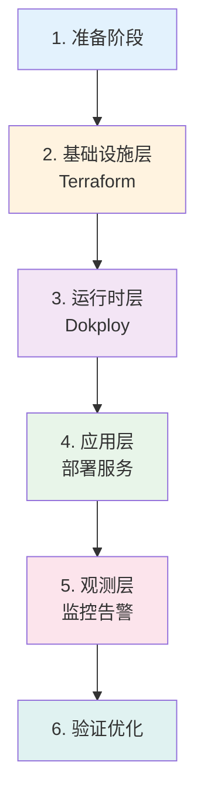
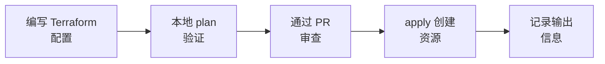
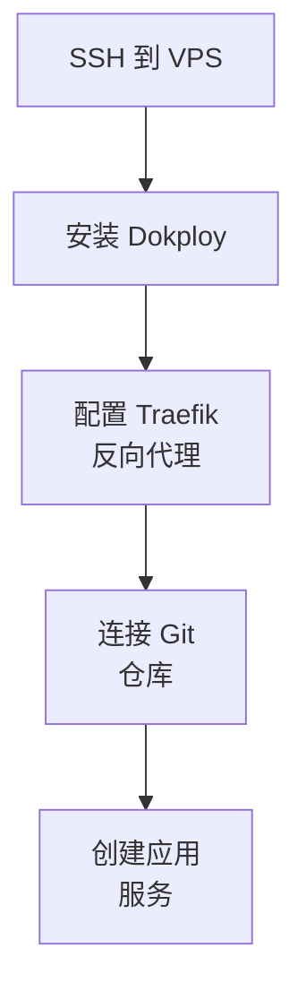
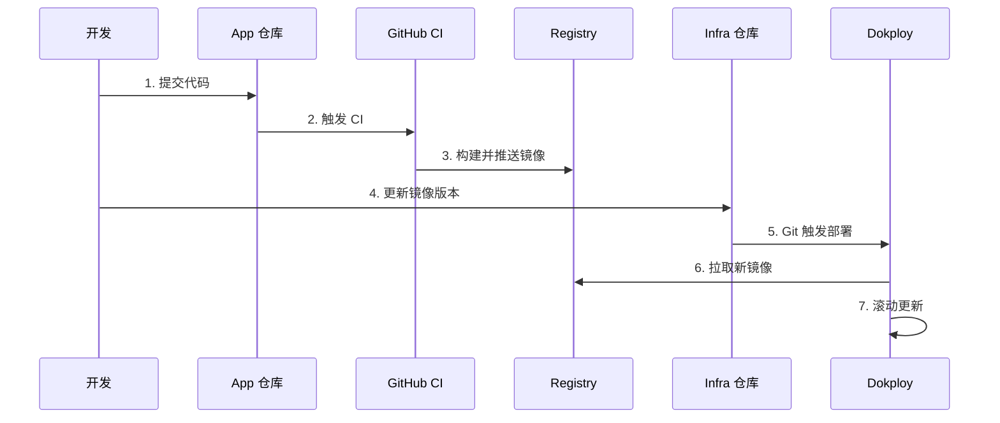
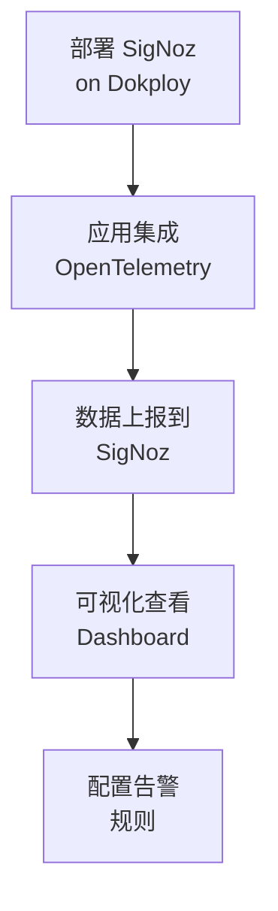
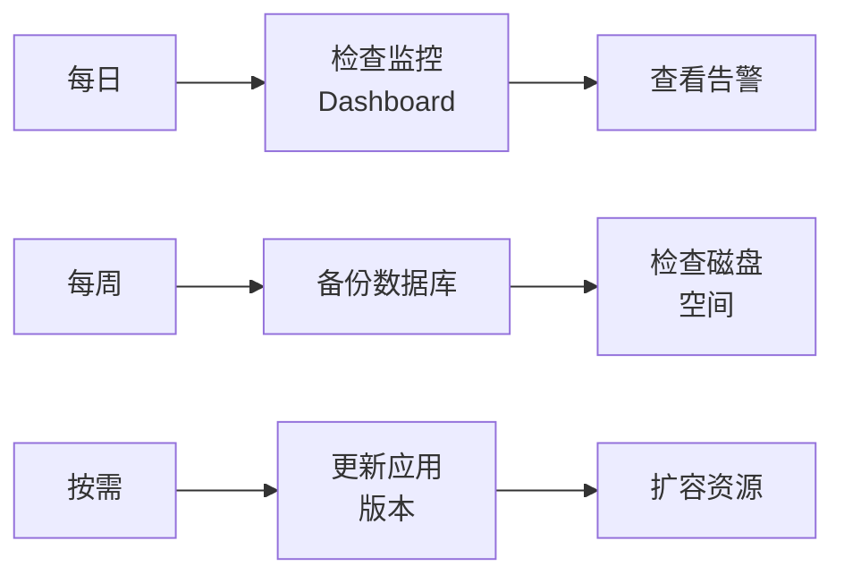
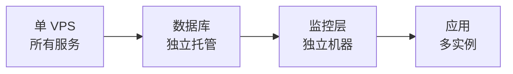

# TRD-004: 环境即服务(EaaS)技术实现概览

> **文档类型:** Technical Reference & Implementation Guide  
> **版本:** 1.0  
> **最后更新:** 2025-12-02  
> **相关文档:** [BRN-004](../../origin/BRN-004.env_eaas_design.md) | [IRD-004](../infra/IRD-004.env_eaas_infra.md)

## 概述

本文档概述基础架构的核心实施步骤和关键关注点，重点在于**理解实施思路**，具体配置细节在实际编码时再深入。

---

## 实施全景图



---

## 一、准备阶段：搭建前的关键准备

### 核心目标
建立开发环境，准备账号和密钥，理解整体架构。

### 关键步骤


**需要准备的账号：**
- GitHub (代码托管 + CI/CD)
- Cloudflare (DNS + CDN)
- VPS 提供商 (Hetzner/DigitalOcean 等)
- Docker Registry (镜像仓库)

**关键关注点：**

> [!IMPORTANT]
> **密钥管理原则**：所有真实密钥只保存在 `infra/terraform/environments/*/terraform.tfvars`，该文件加入 `.gitignore`，绝不提交到 Git。

**目录结构概览：**
```
workspace/
├── myapp/          # App 仓库 (public)
│   ├── apps/       # 业务应用
│   └── libs/       # 共享库
└── infra/          # Infra 仓库 (private)
    ├── terraform/  # IaC 配置
    └── deploy-config/  # 部署配置
```

---

## 二、基础设施层：Terraform 管理资源

### 核心目标
用代码声明和创建所有基础设施（VPS、网络、DNS 等）。

### 实施思路



**核心模块：**

| 模块 | 作用 | 输出 |
|-----|------|------|
| **VPS 模块** | 创建服务器实例 | IP 地址、服务器 ID |
| **Cloudflare 模块** | 配置 DNS、SSL | DNS 记录、证书状态 |
| **网络模块** | 防火墙、安全组 | 网络配置 |

**关键关注点：**

1. **环境隔离**：dev/test/prod 使用相同的 Terraform 模块，只有变量（tfvars）不同
2. **状态管理**：Terraform state 保存在 S3/Terraform Cloud，支持团队协作
3. **PR 工作流**：所有变更必须通过 PR → plan → review → apply

> [!TIP]
> Terraform 是整个架构的"声明式蓝图"，所有基础设施变更都从这里开始。

---

## 三、运行时层：Dokploy 编排容器

### 核心目标
在 VPS 上安装 Dokploy，管理所有容器化服务的生命周期。

### 实施思路



**Dokploy 核心功能：**

- **容器编排**：类似简化版的 Kubernetes，但更轻量
- **自带 Traefik**：自动处理 HTTPS、路由、负载均衡
- **Git 集成**：监听仓库变化，自动拉取部署
- **UI 管理**：可视化管理所有服务和容器

**关键关注点：**

1. **单机起步**：初期所有服务（业务 + DB + 监控）都跑在同一个 VPS
2. **网络隔离**：所有容器连接到 `dokploy-network`，通过 Traefik 对外暴露
3. **GitOps**：部署配置（`deploy-config/` 目录）提交到 infra 仓库，Dokploy 监听变化自动部署

> [!NOTE]
> Dokploy 可以理解为"自托管的 Heroku"，但你完全掌控底层。

---

## 四、应用层：部署业务服务

### 核心目标
将应用构建为 Docker 镜像，通过 Dokploy 部署到 VPS。

### 实施思路



**关键文件：**

- **App 仓库**：`Dockerfile` 定义如何构建镜像
- **Infra 仓库**：`deploy-config/apps/*.compose.yml` 定义如何运行容器

**关键关注点：**

1. **两仓库分离**：app 仓库可公开，infra 仓库私有保存配置和密钥
2. **版本管理**：通过镜像 tag（如 `v1.2.3`）控制部署版本
3. **环境变量**：敏感配置（DB 密码等）在 Dokploy 中设置，不写入代码

**部署流程本质：**
```
代码变更 → CI 构建镜像 → 更新 infra 配置 → Dokploy 自动部署
```

---

## 五、观测层：监控和日志

### 核心目标
部署 SigNoz 收集应用的 metrics、logs、traces，形成完整的可观测性。

### 实施思路



**SigNoz 组成：**

| 组件 | 作用 |
|-----|------|
| **ClickHouse** | 存储时序数据 |
| **OTel Collector** | 接收应用上报的数据 |
| **Query Service** | 查询和聚合 |
| **Frontend** | 可视化 UI |

**关键关注点：**

1. **OpenTelemetry 集成**：应用添加 OTel SDK，自动埋点收集数据
2. **统一接入点**：所有服务上报到同一个 OTel Collector (端口 4317/4318)
3. **资源规划**：SigNoz（特别是 ClickHouse）比较吃内存，建议 8GB+ RAM

**可观测性三支柱：**
- **Metrics**：性能指标（QPS、延迟、错误率）
- **Logs**：应用日志，可按 trace 关联
- **Traces**：请求链路追踪，跨服务调用

> [!TIP]
> SigNoz 是"自托管的 Datadog"，一次部署覆盖所有观测需求。

---

## 六、持续运营：验证和优化

### 核心目标
确保系统稳定运行，建立日常运维流程。

### 关键实践

**验证检查清单：**

- [ ] DNS 解析正确（`nslookup api.example.com`）
- [ ] HTTPS 证书有效（Traefik 自动申请 Let's Encrypt）
- [ ] 应用健康检查通过（`/health` 端点）
- [ ] 监控数据正常上报（SigNoz 有数据流入）
- [ ] 日志可查询（SigNoz Logs 页面）

**日常运维流程：**



**备份策略：**

| 数据类型 | 备份频率 | 保留时间 |
|---------|---------|---------|
| PostgreSQL | 每日 | 30 天 |
| 配置文件 | 每次变更 | 永久 (Git) |
| Terraform State | 自动 | 版本控制 |

**关键关注点：**

1. **故障恢复**：定期测试备份恢复流程，确保可用
2. **监控告警**：设置关键指标告警（CPU > 80%、Error Rate > 1% 等）
3. **容量规划**：监控资源使用趋势，提前扩容

---

## 核心实施原则

### 1. 渐进式部署



**不要一开始就追求完美架构**，从简单开始，按需演进。

### 2. 基础设施即代码

所有资源变更通过 Terraform 进行，任何手动操作都要回补到代码中。

### 3. 拉取式部署

应用部署由 infra 仓库的配置变更触发，而不是直接 push 到生产环境。

### 4. 可观测优先

从第一天就集成监控和日志，而不是出问题了才加。

---

## 常见问题速查

### Q1: Terraform 和 Dokploy 的职责边界是什么？

**Terraform**：管理"有什么资源"（VPS、DNS、网络）  
**Dokploy**：管理"资源上跑什么服务"（容器、应用）

### Q2: 为什么需要两个 Git 仓库？

- **App 仓库（public）**：业务代码可以开源，不含任何敏感信息
- **Infra 仓库（private）**：包含密钥、配置、部署策略，必须私有

### Q3: 单 VPS 能跑多少服务？

根据经验：
- 8GB RAM VPS 可跑：3-5 个业务服务 + PostgreSQL + Redis + SigNoz
- 超过这个负载建议拆分数据库或监控到独立机器

### Q4: 如何回滚版本？

```bash
# 方式1: 修改 infra 仓库中的镜像 tag
image: myapp/api:v1.0.0  # 改回旧版本

# 方式2: 通过 Dokploy UI 手动回滚
# 选择服务 → Deployments → 选择历史版本 → Rollback
```

### Q5: 故障排查第一步是什么？

1. 查看 Dokploy 容器状态：`docker ps`
2. 查看应用日志：`docker logs <container-name>`
3. 检查 SigNoz 是否有错误 trace
4. 验证 DNS 和网络连通性

---

## 实施时间估算

| 阶段 | 工作量 | 主要产出 |
|-----|--------|---------|
| **准备阶段** | 0.5 天 | 账号、密钥、环境 |
| **Terraform 搭建** | 1-2 天 | VPS、DNS、网络配置 |
| **Dokploy 部署** | 0.5 天 | 运行时平台就绪 |
| **应用上线** | 1 天 | 第一个应用部署成功 |
| **监控配置** | 1 天 | SigNoz + OTel 集成 |
| **优化验证** | 1 天 | 备份、告警、文档 |

**总计：约 5-7 个工作日**完成从零到完整可用的生产环境。

---

## 下一步行动

完成阅读后，建议的行动顺序：

1. ✅ **理解架构**：回顾 [IRD-004](../infra/IRD-004.dev_test_prod_infra.md) 巩固整体认知
2. ✅ **准备环境**：注册账号、生成密钥
3. ✅ **小步实验**：先在本地 Docker 跑通应用
4. ✅ **搭建 dev 环境**：用最小配置验证整个流程
5. ✅ **完善 prod 环境**：基于 dev 的经验，正式部署生产

> [!NOTE]
> 本文档关注"做什么"和"为什么"，具体"怎么做"的代码和配置在实施时再详细编写。保持灵活，根据实际情况调整。
